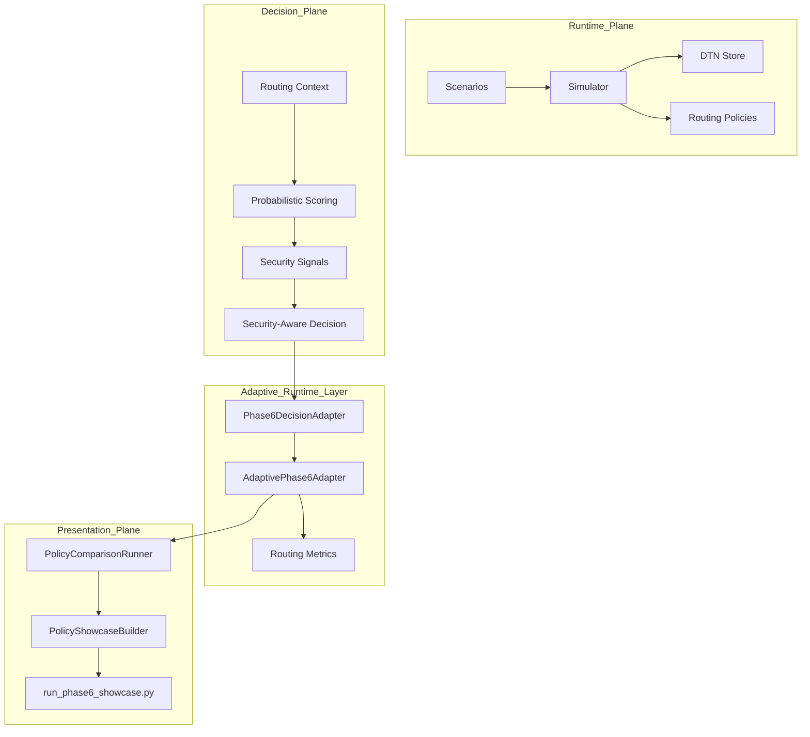
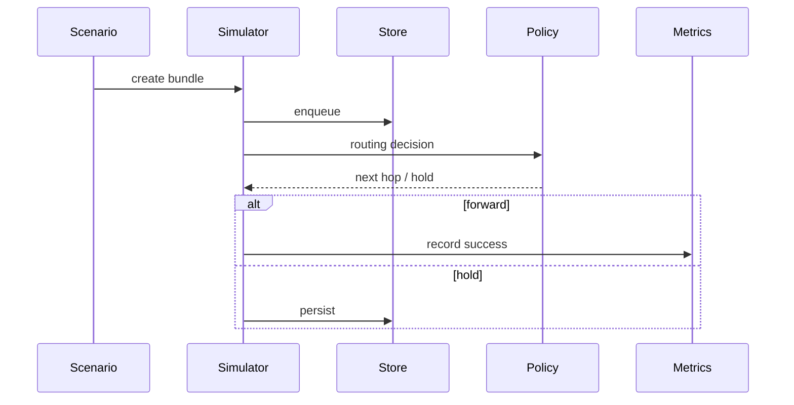
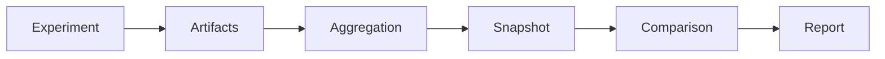

# AetherNet

**A Secure Delay-Tolerant Distributed Infrastructure Prototype for Space Networks**

> Status: Phase-6/7 Runtime Showcase Ready  
> Next: Live Simulation Integration & Visualization


---

## What AetherNet Is

AetherNet is a **deterministic Delay-Tolerant Networking (DTN) simulation and experimentation platform** designed for space-like environments:

- intermittent connectivity
- long propagation delays
- store-carry-forward forwarding
- constrained contact windows
- routing-policy experimentation
- resilience and adversarial modeling
- security-aware routing evaluation

It is built for:

- DTN routing research
- reproducible experiment pipelines
- space network resilience modeling
- security-aware decision experiments
- AI-agent / engineer handoff continuity

---

## Core Philosophy: Determinism as an Experimental Primitive

AetherNet enforces:

> **Routing policy = the primary experimental variable**

All stochastic behaviors, including loss, delay, degradation, and adversarial conditions, are:

- pre-generated
- seed-controlled
- replayable
- serialized

This guarantees:

- exact experiment replay
- deterministic comparison across runs
- stable reports and artifacts
- scientifically valid routing evaluation

---

## Repository Mental Model

```text
Phase-1 / 2 / 2.2 = transport core
Phase-3            = routing brain
Phase-4            = stress / resilience shell
Phase-5            = research pipeline & comparison system
Phase-6            = decision intelligence / security layer
Phase-7            = runtime bridge, adaptive policy, and showcase layer
````

---

## Project Phases

### Phase 1–5: DTN Simulation Core & Research Pipeline

AetherNet includes a deterministic runtime simulator with:

* contact-aware routing
* CGR-lite reasoning
* multi-path candidate selection
* strict priority queueing
* store-carry-forward persistence
* congestion / eviction modeling
* failure / partition modeling

Phase-5 adds a reproducible research pipeline:

* parameter sweep execution
* aggregation and research tables
* snapshot system
* snapshot comparison and lineage validation
* JSON / CSV / Markdown export
* deterministic research reports

✅ Fully integrated into the runtime simulator.

---

### Phase-6: Security-Aware Probabilistic Decision Layer

Phase-6 introduces a deterministic decision pipeline that evaluates candidate links and produces:

* probabilistic link reliability
* explainable scoring
* security threat signals
* routing safety classification
* benchmark-ready decision artifacts

The core classification model is:

```text
preferred → safest / highest-quality candidate
allowed   → usable but degraded or lower-confidence candidate
avoid     → unsafe or adversarial candidate
```

✅ Core decision layer, artifact export, report generation, and comparison mode are complete.

---

### Phase-7: Runtime Bridge, Adaptive Policy, and Showcase

Phase-7 begins connecting Phase-6 decisions to runtime behavior.

Implemented so far:

* runtime bridge adapter
* `avoid` link filtering
* `preferred` / `allowed` prioritization
* routing impact metrics
* deterministic adaptive modes:

  * conservative
  * balanced
  * aggressive
* automated policy comparison
* publishable CLI showcase report

Important boundary:

> The Phase-7 showcase is complete, but the main Phase-5 simulation loop does not yet globally enable adaptive Phase-6 routing by default.

---

## Phase-6 / Phase-7 Runtime Showcase

Run the deterministic runtime policy showcase:

```bash
python scripts/run_phase6_showcase.py
```

Expected output:

```text
=== Phase-6 Runtime Policy Showcase ===
Case: mixed-risk-demo

[Candidate Outputs]
Baseline: L1, L2
Conservative: L1
Balanced: L1, L2
Aggressive: L2, L1

[Policy Differences]
Conservative removed compared to Balanced: L2
Aggressive order differs from Balanced: yes

[Interpretation]
Conservative mode reduces routing freedom when safer preferred links exist.
Aggressive mode preserves original safe ordering while still excluding avoid links.
```

All outputs are deterministic and reproducible across runs.

### Showcase Scenario

The showcase uses a fixed mixed-risk scenario:

```text
Input candidate order: L2, L3, L1
```

| Link | Condition | Decision  |
| ---- | --------- | --------- |
| L1   | clean     | preferred |
| L2   | degraded  | allowed   |
| L3   | jammed    | avoid     |

### Showcase Modes

| Mode         | Behavior                                                       |
| ------------ | -------------------------------------------------------------- |
| Baseline     | filters `avoid`, then prioritizes `preferred` before `allowed` |
| Conservative | keeps only `preferred` links when available                    |
| Balanced     | keeps `preferred` first, then `allowed`                        |
| Aggressive   | removes `avoid`, but preserves original safe candidate order   |

---

## System Position

AetherNet is organized into three planes:

```text
Runtime Plane
    → executes DTN forwarding and store-carry-forward simulation

Decision Plane
    → evaluates candidate links and produces preferred / allowed / avoid decisions

Presentation Plane
    → renders artifacts into reports, comparisons, and showcase output
```

---

## Phase-6 Core Decision Pipeline

```text
ScenarioSpec
→ ScenarioGenerator
→ RoutingContext
→ ProbabilisticScorer
→ SecuritySignalBuilder
→ SecurityAwareRoutingEngine
→ Evaluation / Benchmark
```

---

## Phase-6 / Phase-7 Showcase Pipeline

```text
RoutingContext
→ Phase6DecisionAdapter
→ AdaptivePhase6Adapter
→ PolicyComparisonRunner
→ PolicyShowcaseBuilder
→ scripts/run_phase6_showcase.py
```

This enables:

* deterministic runtime decision comparison
* adaptive policy behavior comparison
* human-readable showcase reports
* future UI / dashboard integration

---

## Deterministic Guarantees

For a fixed input:

```text
(ScenarioSpec, Seed, TimeIndex, CandidateSet)
```

AetherNet guarantees stable outputs for:

* RoutingContext
* RoutingScoreReport
* SecuritySignalReport
* SecurityAwareRoutingDecision
* PolicyComparisonResult
* PolicyShowcaseReport

Properties:

1. Seed determinism
2. Execution determinism
3. Stable serialization
4. No mutation leakage from exported artifacts
5. No random runtime behavior in adaptive modes

---

## Built-in Reference Scenarios

### Core DTN Scenarios

| Scenario                | Description                     |
| ----------------------- | ------------------------------- |
| default_multihop        | baseline forwarding correctness |
| delayed_delivery        | hold-then-forward behavior      |
| expiry_before_contact   | TTL expiration                  |
| multipath_competition   | competing relay paths           |
| contact_timing_tradeoff | timing-sensitive routing        |

---

## Architecture Overview



---

## Runtime Lifecycle



---

## Phase-5 Research Lifecycle



---

## Core Source Areas

### Routing / decision logic

```text
router/
metrics/
```

### Storage / resilience

```text
router/store_capacity.py
router/eviction_policy.py
router/failure_model.py
```

### Simulation

```text
sim/
protocol/
store/
```

### Phase-6 demo layer

```text
aether_demo/
```

### Phase-7 runtime / adaptive showcase layer

```text
aether_phase6_runtime/
scripts/run_phase6_showcase.py
```

---

## How to Run

### Setup

```bash
python3 -m venv .venv
source .venv/bin/activate
make setup-dev
```

### Smoke test

```bash
make smoke
```

### Standard demo

```bash
make demo
```

### Run a specific scenario

```bash
python3 demo.py --scenario default_multihop
```

### Run Phase-6 / Phase-7 runtime showcase

```bash
python scripts/run_phase6_showcase.py
```

### Run tests

```bash
make test
```

---

## Current Limitations

* The adaptive Phase-6 runtime layer is built and tested, but the main simulator loop does not yet globally enable it by default.
* Current adaptive modes are deterministic and rule-based; there is no ML or reinforcement learning.
* The decision layer evaluates candidate links, not full end-to-end secure graph paths.
* There is no rich visualization or dashboard layer yet.
* Multi-hop secure path synthesis remains future work.

---

## Next Roadmap

```text
Current milestone:
- Phase-6 decision system complete
- Phase-7 runtime showcase complete

Next:
- Live simulation-loop integration
- Visualization / dashboard layer
- Advanced benchmark and tournament tooling
- Multi-hop security-aware path synthesis
```

---

## Summary

AetherNet is now:

> a deterministic DTN research infrastructure with a security-aware decision layer, adaptive runtime showcase, and reproducible policy comparison artifacts.

It is evolving toward:

> deterministic, explainable, security-aware space networking systems.

