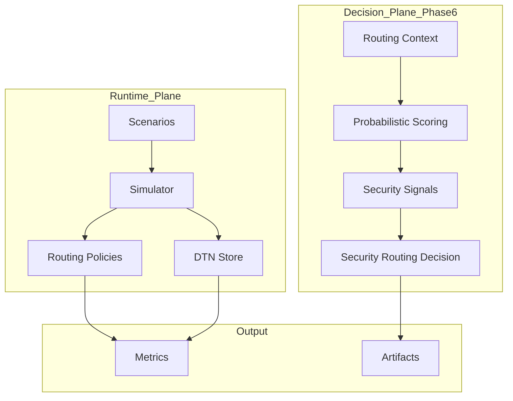
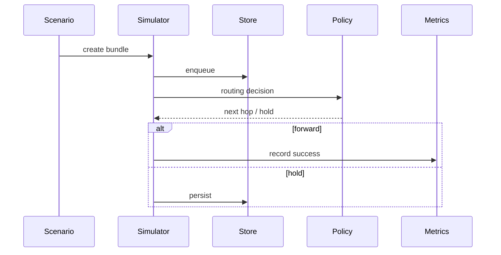
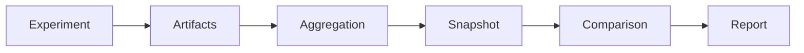

# AetherNet

**A Secure Delay-Tolerant Distributed Infrastructure Prototype for Space Networks**

> Status: Phase-6 Core COMPLETE  
> Next: Phase-6 Demo Integration (Wave-84~87)


---

## What AetherNet Is

AetherNet is a **deterministic Delay-Tolerant Networking (DTN) simulation and experimentation platform** designed for space-like environments:

- intermittent connectivity
- long propagation delays
- store-carry-forward forwarding
- constrained contact windows
- routing-policy experimentation
- resilience and adversarial modeling

It is built for:

- DTN routing research
- reproducible experiment pipelines
- resilience / failure modeling
- security-aware routing evaluation
- AI-agent / engineer handoff continuity

---

## Core Philosophy: Determinism as an Experimental Primitive

AetherNet enforces:

> **Routing policy = the ONLY variable**

All stochastic behaviors (loss, delay, compromise) are:

- pre-generated
- seed-controlled
- replayable
- serialized

This guarantees:

- exact experiment replay
- deterministic comparison across runs
- scientifically valid routing evaluation

---

## Repository Mental Model

```text
Phase-1 / 2 / 2.2 = transport core
Phase-3            = routing brain
Phase-4            = stress / resilience shell
Phase-5            = research pipeline & comparison system
Phase-6            = decision intelligence / security layer
````

---

## Project Phases

### Phase 1–5: DTN Simulation Core & Research Pipeline

#### Transport + Routing + Stress Layers

* contact-aware routing
* CGR-lite reasoning
* multi-path candidate selection
* strict priority queue
* store-carry-forward persistence
* congestion / eviction modeling
* failure / partition modeling

#### Research Pipeline (Phase-5)

* parameter sweep execution
* aggregation & research tables
* snapshot system (versioned artifacts)
* snapshot comparison & lineage validation
* JSON / CSV / Markdown export
* deterministic research reports

✅ Fully integrated into runtime simulator

---

## Phase-6: Security-Aware Probabilistic Decision Layer

Phase-6 introduces a **deterministic decision pipeline** that evaluates network state and produces:

* probabilistic link reliability
* explainable scoring
* security threat signals
* routing safety classification
* benchmark-ready decision artifacts

---

## Phase-6 System Position

AetherNet is now composed of **two planes**:

```text
Runtime Plane (Phase 1–5)
    → executes DTN forwarding

Decision Plane (Phase-6)
    → evaluates + recommends routing decisions
```

Important:

* Phase-6 is **fully deterministic**
* Phase-6 is **decoupled from runtime execution**
* Phase-6 currently operates as an **offline evaluation/control plane**

👉 Integration into runtime is planned in upcoming waves.

---

## Phase-6 Pipeline

```text
ScenarioSpec
→ ScenarioGenerator
→ RoutingContext
→ ProbabilisticScorer
→ SecuritySignalBuilder
→ SecurityAwareRoutingEngine
→ Evaluation / Benchmark
```

---

## Deterministic Guarantees (Formal)

For any given:

```text
(ScenarioSpec, Seed, TimeIndex, CandidateSet)
```

AetherNet guarantees identical outputs:

* RoutingContext
* RoutingScoreReport
* SecuritySignalReport
* RoutingDecision

Properties:

1. Seed Determinism
2. Execution Determinism
3. Serialization Determinism
4. Isolation (no mutation across layers)

---

## Built-in Reference Scenarios

AetherNet includes deterministic baseline scenarios for validation and demo.

### `default_multihop`

* baseline DTN forwarding
* multi-hop delivery validation

### `delayed_delivery`

* validates hold-then-forward behavior
* ensures deterministic delayed routing

### `expiry_before_contact`

* validates TTL expiration
* ensures strict lifecycle enforcement

### `multipath_competition`

* competing relay paths
* only one valid downstream path

Expected:

* baseline → may fail
* multipath → succeeds

### `contact_timing_tradeoff`

* timing-sensitive routing decision

Expected:

* baseline → fails
* contact-aware → succeeds

---

## Architecture Overview



For additional architecture documentation, see:

* `docs/architecture.md`
* `docs/system-sequence.md`
* `docs/system-sequence-phase-6.md`

---

## Runtime Lifecycle



---

## Phase-5 Research Lifecycle



---

## Core Source Areas

### Routing / decision logic

```text
router/routing_policies.py
router/contact_graph.py
router/route_scoring.py
router/routing_decision.py
metrics/routing_metrics.py
```

### Storage / stress / resilience

```text
router/store_capacity.py
router/eviction_policy.py
router/qos.py
router/failure_model.py
metrics/congestion_metrics.py
```

### Transport / simulation

```text
protocol/
sim/
store/
bundle_queue/
```

### Documentation / handoff

```text
README.md
docs/roadmap.md
docs/roadmap-phase-5.md
docs/roadmap-phase-6.md
docs/system-sequence.md
docs/system-sequence-phase-5.md
docs/system-sequence-phase-6.md
docs/architecture.md
docs/phase-2-whitepaper.md
docs/phase-2-2-whitepaper.md
docs/phase-3-4-whitepaper.md
docs/phase-5-whitepaper.md
docs/phase-6-whitepaper.md
```

### Phase-5 Research Source Areas

```text
sim/experiment_harness.py
sim/parameter_sweep.py
sim/sweep_aggregation.py
sim/research_table_export.py
sim/research_export_manifest.py
sim/research_snapshot.py
sim/research_snapshot_query.py
sim/research_snapshot_compare.py
sim/research_comparison_export.py
sim/research_snapshot_registry.py
sim/research_report.py
```

---

## How to Run

### 1. Environment setup

AetherNet requires Python 3.10+.

```bash
python3 -m venv .venv
source .venv/bin/activate
make setup-dev
```

### 2. Smoke validation

```bash
make smoke
```

### 3. Run demo

```bash
make demo
```

or:

```bash
./scripts/run_demo.sh
```

### 3.1 Run specific scenario

```bash
python3 demo.py --scenario default_multihop
```

### 3.2 Override routing mode

```bash
python3 demo.py --scenario default_multihop --routing-mode baseline
python3 demo.py --scenario default_multihop --routing-mode contact_aware
python3 demo.py --scenario default_multihop --routing-mode multipath
```

### 3.3 Recommended demo sequences

#### Baseline DTN behavior

```bash
python3 demo.py
```

#### Multipath advantage

```bash
python3 demo.py --scenario multipath_competition --routing-mode baseline
python3 demo.py --scenario multipath_competition --routing-mode multipath
```

#### Contact-aware routing advantage

```bash
python3 demo.py --scenario contact_timing_tradeoff --routing-mode baseline
python3 demo.py --scenario contact_timing_tradeoff --routing-mode contact_aware
```

### 4. Run all built-in comparisons

```bash
make compare
```

or:

```bash
./scripts/run_compare.sh
```

### 5. Run tests

```bash
make test
```

or:

```bash
pytest tests/
```

---

## How to Interpret Demo Results

> Only routing policy changes — everything else is deterministic.

| Scenario                | Meaning                  |
| ----------------------- | ------------------------ |
| default_multihop        | baseline correctness     |
| multipath_competition   | path ambiguity           |
| contact_timing_tradeoff | future-contact reasoning |

---

## Current Limitations

* Phase-6 is not yet integrated into runtime routing loop
* no visualization layer for security signals
* no multi-hop path synthesis in decision layer

---

## Next Roadmap

```text
Phase-6 Demo Integration:

Wave-84: scenario integration
Wave-85: artifact export
Wave-86: human-readable output
Wave-87: runtime bridging
```

---

## Summary

AetherNet is now:

> a deterministic DTN research infrastructure with a full experiment → evaluation → comparison pipeline

and evolving toward:

> **security-aware, intelligent space networking systems**

