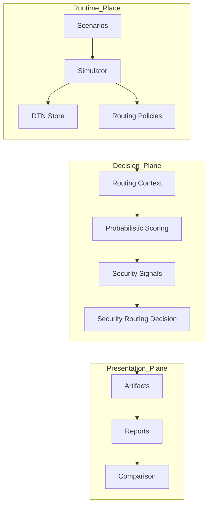
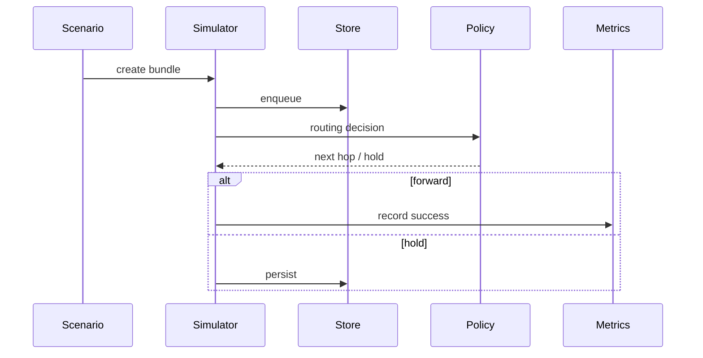
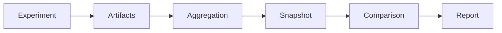

# AetherNet

**A Secure Delay-Tolerant Distributed Infrastructure Prototype for Space Networks**

> Status: Phase-6 Core + Demo Layer COMPLETE  
> Next: Phase-7 (Runtime Integration & Visualization)


---

## What AetherNet Is

AetherNet is a **deterministic Delay-Tolerant Networking (DTN) simulation and experimentation platform** designed for space-like environments:

- intermittent connectivity
- long propagation delays
- store-carry-forward forwarding
- constrained contact windows
- routing-policy experimentation
- resilience and adversarial modeling

It is built for:

- DTN routing research
- reproducible experiment pipelines
- resilience / failure modeling
- security-aware routing evaluation
- AI-agent / engineer handoff continuity

---

## Core Philosophy: Determinism as an Experimental Primitive

AetherNet enforces:

> **Routing policy = the ONLY variable**

All stochastic behaviors (loss, delay, compromise) are:

- pre-generated
- seed-controlled
- replayable
- serialized

This guarantees:

- exact experiment replay
- deterministic comparison across runs
- scientifically valid routing evaluation

---

## Repository Mental Model

```text
Phase-1 / 2 / 2.2 = transport core
Phase-3            = routing brain
Phase-4            = stress / resilience shell
Phase-5            = research pipeline & comparison system
Phase-6            = decision intelligence / security layer
```

---

## Project Phases

### Phase 1–5: DTN Simulation Core & Research Pipeline

#### Transport + Routing + Stress Layers

* contact-aware routing
* CGR-lite reasoning
* multi-path candidate selection
* strict priority queue
* store-carry-forward persistence
* congestion / eviction modeling
* failure / partition modeling

#### Research Pipeline (Phase-5)

* parameter sweep execution
* aggregation & research tables
* snapshot system (versioned artifacts)
* snapshot comparison & lineage validation
* JSON / CSV / Markdown export
* deterministic research reports

✅ Fully integrated into runtime simulator

---

## Phase-6: Security-Aware Probabilistic Decision Layer

Phase-6 introduces a **deterministic decision pipeline** that evaluates network state and produces:

* probabilistic link reliability
* explainable scoring
* security threat signals
* routing safety classification
* benchmark-ready decision artifacts

---

## Phase-6 System Position

AetherNet is now composed of **three planes**:

```text
Runtime Plane (Phase 1–5)
    → executes DTN forwarding

Decision Plane (Phase-6)
    → evaluates + recommends routing decisions

Presentation Plane (Phase-6 Demo)
    → renders decision artifacts into reports and comparisons
```

Important:

* Phase-6 is **fully deterministic**
* Phase-6 is **decoupled from runtime execution**
* Phase-6 currently operates as an **offline evaluation/control plane**
* Demo layer provides **artifact export, reporting, and scenario comparison**

👉 Runtime integration is planned for Phase-7

---

## Phase-6 Core Pipeline

```text
ScenarioSpec
→ ScenarioGenerator
→ RoutingContext
→ ProbabilisticScorer
→ SecuritySignalBuilder
→ SecurityAwareRoutingEngine
→ Evaluation / Benchmark
```

---

## Phase-6 Demo Pipeline

```text
Phase6ScenarioRegistry
→ Phase6DemoArtifactBuilder
→ Phase6DemoReportBuilder
→ Phase6DemoBridge
→ Phase6ComparisonBuilder
```

This enables:

* deterministic artifact bundles
* human-readable reports
* scenario-to-scenario comparison

---

## Deterministic Guarantees (Formal)

For any given:

```text
(ScenarioSpec, Seed, TimeIndex, CandidateSet)
```

AetherNet guarantees identical outputs:

* RoutingContext
* RoutingScoreReport
* SecuritySignalReport
* SecurityAwareRoutingDecision

Properties:

1. Seed Determinism
2. Execution Determinism
3. Serialization Determinism
4. Isolation (no mutation across layers)

---

## Built-in Reference Scenarios

### Core DTN Scenarios

| Scenario                | Description                     |
| ----------------------- | ------------------------------- |
| default_multihop        | baseline forwarding correctness |
| delayed_delivery        | hold-then-forward behavior      |
| expiry_before_contact   | TTL expiration                  |
| multipath_competition   | competing relay paths           |
| contact_timing_tradeoff | timing-sensitive routing        |

---

## Phase-6 Demo Usage (Python API)

### Run a Phase-6 scenario

```python
from aether_demo import Phase6DemoBridge, Phase6ScenarioRegistry

bridge = Phase6DemoBridge()

result = bridge.run_scenario(
    scenario_name=Phase6ScenarioRegistry.SCENARIO_CLEAN,
    source_node_id="N1",
    destination_node_id="N2",
    time_index=1,
)

print(result.report.text)
```

---

### Compare two scenarios

```python
from aether_demo import Phase6ComparisonBuilder

comp = Phase6ComparisonBuilder().build_from_runs(result_a, result_b)

print(comp.text)
```

This produces deterministic, human-readable comparison output.

---

## Architecture Overview



---

## Runtime Lifecycle



---

## Phase-5 Research Lifecycle



---

## Core Source Areas

### Routing / decision logic

```text
router/
metrics/
```

### Storage / resilience

```text
router/store_capacity.py
router/eviction_policy.py
router/failure_model.py
```

### Simulation

```text
sim/
protocol/
store/
```

### Phase-6 Demo Layer

```text
aether_demo/
```

---

## How to Run

### Setup

```bash
python3 -m venv .venv
source .venv/bin/activate
make setup-dev
```

### Smoke

```bash
make smoke
```

### Demo

```bash
make demo
```

### Run specific scenario

```bash
python3 demo.py --scenario default_multihop
```

### Run tests

```bash
make test
```

---

## Current Limitations

* Phase-6 is not yet integrated into runtime forwarding loop
* decision outputs are not yet used in live routing
* no visualization/dashboard layer
* no multi-hop path synthesis

---

## Next Roadmap

```text
Phase-6 COMPLETE

Next:
- Runtime decision integration (Phase-7)
- Visualization / reporting enhancements
- Advanced benchmarking
```

---

## Summary

AetherNet is now:

> a deterministic DTN research infrastructure with a full experiment → evaluation → comparison pipeline

and evolving toward:

> **security-aware, intelligent space networking systems**


