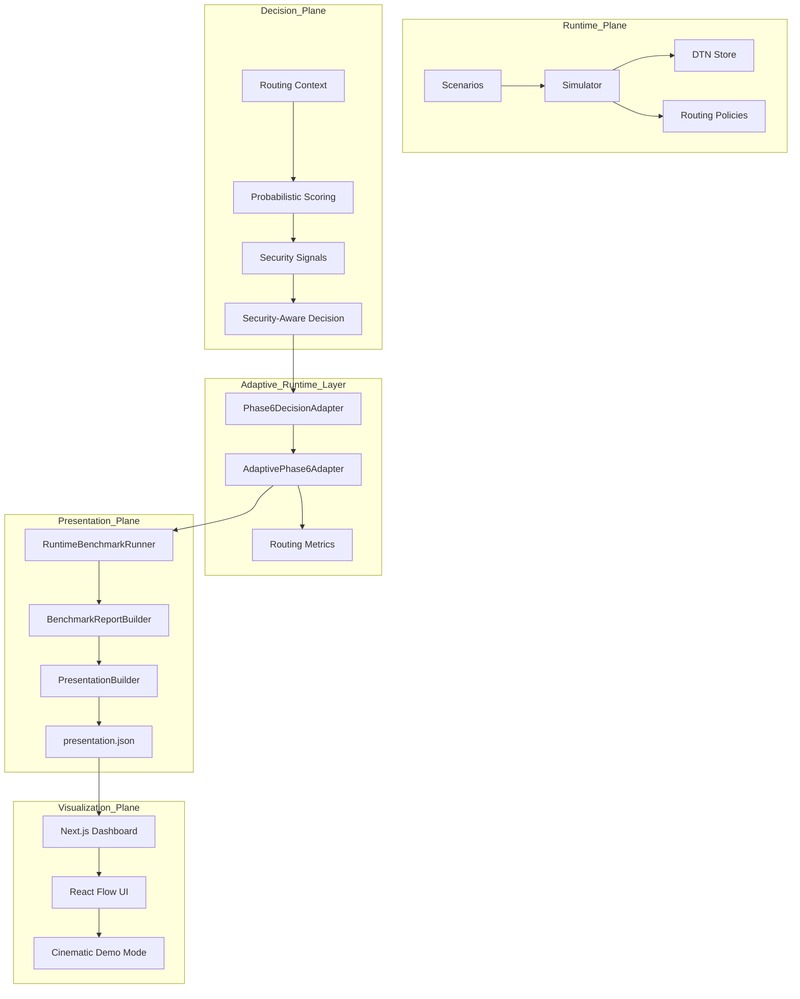
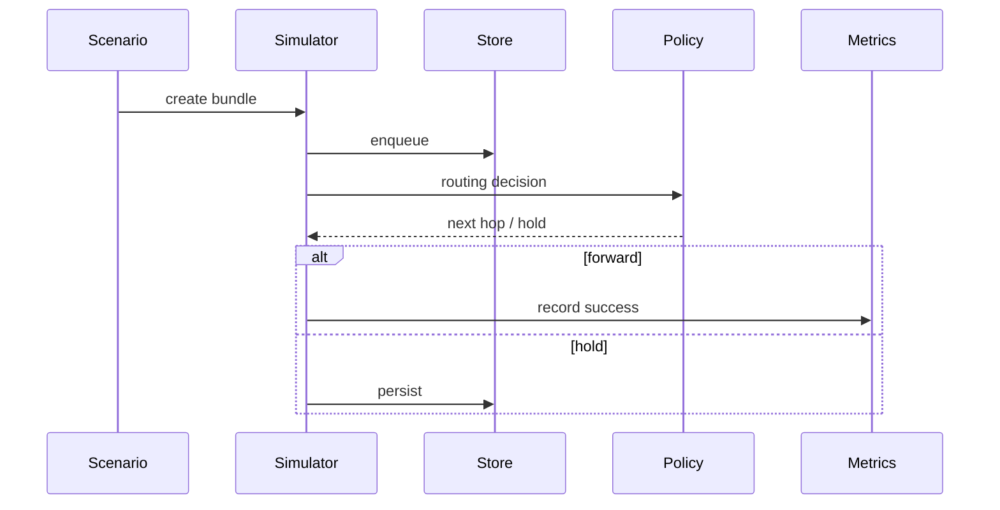
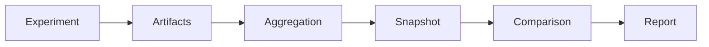
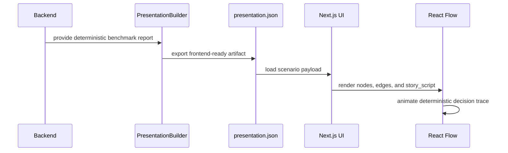

# AetherNet

**A Secure Delay-Tolerant Distributed Infrastructure Prototype for Space Networks**

> Status: `v0.8-cinematic-demo` — Phase-6/7 Runtime Showcase + Cinematic Visualization Ready  
> Next: Research packaging, live simulation-loop integration, and multi-hop security-aware path synthesis


---

## What AetherNet Is

AetherNet is a **deterministic Delay-Tolerant Networking (DTN) simulation and experimentation platform** designed for space-like environments:

- intermittent connectivity
- long propagation delays
- store-carry-forward forwarding
- constrained contact windows
- routing-policy experimentation
- resilience and adversarial modeling
- security-aware routing evaluation
- explainable routing decision visualization

It is built for:

- DTN routing research
- reproducible experiment pipelines
- space network resilience modeling
- security-aware decision experiments
- routing decision explainability
- AI-agent / engineer handoff continuity

AetherNet makes invisible network routing decisions visible, traceable, and explainable.

---

## Core Philosophy: Determinism as an Experimental Primitive

AetherNet enforces:

> **Routing policy = the primary experimental variable**

All stochastic behaviors, including loss, delay, degradation, and adversarial conditions, are:

- pre-generated
- seed-controlled
- replayable
- serialized

This guarantees:

- exact experiment replay
- deterministic comparison across runs
- stable reports and artifacts
- scientifically valid routing evaluation
- frontend visualizations driven by reproducible backend artifacts

---

## Repository Mental Model

```text
Phase-1 / 2 / 2.2 = transport core
Phase-3            = routing brain
Phase-4            = stress / resilience shell
Phase-5            = research pipeline & comparison system
Phase-6            = decision intelligence / security layer
Phase-7            = runtime bridge, adaptive policy, and showcase layer
Phase-8            = presentation layer and cinematic demo packaging
````

---

## Project Phases

### Phase 1–5: DTN Simulation Core & Research Pipeline

AetherNet includes a deterministic runtime simulator with:

* contact-aware routing
* CGR-lite reasoning
* multi-path candidate selection
* strict priority queueing
* store-carry-forward persistence
* congestion / eviction modeling
* failure / partition modeling

Phase-5 adds a reproducible research pipeline:

* parameter sweep execution
* aggregation and research tables
* snapshot system
* snapshot comparison and lineage validation
* JSON / CSV / Markdown export
* deterministic research reports

Fully integrated into the runtime simulator.

---

### Phase-6: Security-Aware Probabilistic Decision Layer

Phase-6 introduces a deterministic decision pipeline that evaluates candidate links and produces:

* probabilistic link reliability
* explainable scoring
* security threat signals
* routing safety classification
* benchmark-ready decision artifacts

The core classification model is:

```text
preferred → safest / highest-quality candidate
allowed   → usable but degraded or lower-confidence candidate
avoid     → unsafe or adversarial candidate
```

Completed scope:

* core decision layer
* artifact export
* report generation
* benchmark execution
* comparison mode
* deterministic decision trace generation

---

### Phase-7: Runtime Bridge, Adaptive Policy, and Showcase

Phase-7 begins connecting Phase-6 decisions to runtime behavior.

Implemented so far:

* runtime bridge adapter
* `avoid` link filtering
* `preferred` / `allowed` prioritization
* routing impact metrics
* deterministic adaptive modes:

  * conservative
  * balanced
  * aggressive
* automated policy comparison
* publishable CLI showcase report

Important boundary:

> The Phase-7 showcase is complete, but the main Phase-5 simulation loop does not yet globally enable adaptive Phase-6 routing by default.

---

### Phase-8: Presentation Layer and Cinematic Demo

Phase-8 packages Phase-6/7 routing decisions into a frontend-ready presentation artifact and renders them in a cinematic React Flow interface.

Implemented so far:

* `presentation.json` export layer
* frontend-ready scenario payloads
* React / Next.js dashboard
* React Flow routing decision visualization
* step-by-step story playback
* Mission Control-style dark UI
* recording-ready presentation mode
* URL-driven demo mode:

  * `mode=presentation`
  * `clean=true`
  * `recording=true`
  * `scenario=jammed`

This layer does **not** perform routing logic in the frontend. The UI renders backend-generated artifacts only.

---

## Phase-6 / Phase-7 Runtime Showcase

Run the deterministic runtime policy showcase:

```bash
python scripts/run_phase6_showcase.py
```

Expected output:

```text
=== Phase-6 Runtime Policy Showcase ===
Case: mixed-risk-demo

[Candidate Outputs]
Baseline: L1, L2
Conservative: L1
Balanced: L1, L2
Aggressive: L2, L1

[Policy Differences]
Conservative removed compared to Balanced: L2
Aggressive order differs from Balanced: yes

[Interpretation]
Conservative mode reduces routing freedom when safer preferred links exist.
Aggressive mode preserves original safe ordering while still excluding avoid links.
```

All outputs are deterministic and reproducible across runs.

### Showcase Scenario

The showcase uses a fixed mixed-risk scenario:

```text
Input candidate order: L2, L3, L1
```

| Link | Condition | Decision  |
| ---- | --------- | --------- |
| L1   | clean     | preferred |
| L2   | degraded  | allowed   |
| L3   | jammed    | avoid     |

### Showcase Modes

| Mode         | Behavior                                                       |
| ------------ | -------------------------------------------------------------- |
| Baseline     | filters `avoid`, then prioritizes `preferred` before `allowed` |
| Conservative | keeps only `preferred` links when available                    |
| Balanced     | keeps `preferred` first, then `allowed`                        |
| Aggressive   | removes `avoid`, but preserves original safe candidate order   |

---

## Cinematic Demo Showcase

AetherNet now includes a local Mission Control-style visualization layer for explaining routing decisions.

The recommended demo scenario is:

```text
jammed
```

In this scenario:

* legacy routing selects a risky candidate
* Phase-6 selects a safer alternative
* the decision trace is rendered as an animated graph
* the narrative overlay explains each step

### Recording-ready demo URL

```text
http://localhost:3000/?mode=presentation&clean=true&recording=true&scenario=jammed
```

### Standard dashboard URL

```text
http://localhost:3000
```

## Demo Page Overview

The cinematic demo page is designed as a Mission Control-style interface for replaying and explaining routing decisions.


The page has two primary modes:

### Standard Dashboard Mode

```text
http://localhost:3000
````

This mode is intended for development, inspection, and manual exploration.

It includes:

* scenario selector for switching between `clean`, `degraded`, `jammed`, and `mixed_risk`
* manual playback controls: reset, step, and auto
* routing decision panel comparing legacy, Phase-6 balanced, and Phase-6 adaptive results
* topology metrics panel showing nodes, edges, evaluated modes, and divergence
* JSON export button for downloading the current presentation artifact

### Recording / Presentation Mode

```text
http://localhost:3000/?mode=presentation&clean=true&recording=true&scenario=jammed
```


This mode is intended for screen recording, portfolio demos, and external presentations.

It automatically:

* selects the requested scenario
* starts the story playback loop
* hides manual controls and debug panels
* expands the React Flow canvas
* keeps the narrative overlay visible
* presents a clean, cinematic routing decision replay

The recommended scenario for recording is:

```text
jammed
```

because it clearly shows the divergence between legacy routing and Phase-6 security-aware routing:

* legacy routing selects a risky candidate
* Phase-6 selects a safer alternative
* the decision trace is animated step by step
* the narrative overlay explains the routing decision as it unfolds

---

## System Position

AetherNet is organized into four planes:

```text
Runtime Plane
    → executes DTN forwarding and store-carry-forward simulation

Decision Plane
    → evaluates candidate links and produces preferred / allowed / avoid decisions

Presentation Plane
    → converts reports, decisions, and traces into stable artifacts

Visualization Plane
    → renders presentation artifacts into a React Flow Mission Control UI
```

---

## Phase-6 Core Decision Pipeline

```text
ScenarioSpec
→ ScenarioGenerator
→ RoutingContext
→ ProbabilisticScorer
→ SecuritySignalBuilder
→ SecurityAwareRoutingEngine
→ Evaluation / Benchmark
```

---

## Phase-6 / Phase-7 Showcase Pipeline

```text
RoutingContext
→ Phase6DecisionAdapter
→ AdaptivePhase6Adapter
→ PolicyComparisonRunner
→ PolicyShowcaseBuilder
→ scripts/run_phase6_showcase.py
```

This enables:

* deterministic runtime decision comparison
* adaptive policy behavior comparison
* human-readable showcase reports
* frontend visualization integration

---

## Phase-8 Presentation / Visualization Pipeline

```text
RuntimeBenchmarkRunner
→ BenchmarkReportBuilder
→ PresentationBuilder
→ presentation.json
→ Next.js Dashboard
→ React Flow Mission Control UI
→ Recording / Presentation Mode
```

This enables:

* artifact-driven frontend rendering
* no routing inference in the UI
* deterministic replay of decision traces
* recording-ready visual demos
* portfolio-friendly presentation mode

---

## Deterministic Guarantees

For a fixed input:

```text
(ScenarioSpec, Seed, TimeIndex, CandidateSet)
```

AetherNet guarantees stable outputs for:

* RoutingContext
* RoutingScoreReport
* SecuritySignalReport
* SecurityAwareRoutingDecision
* PolicyComparisonResult
* PolicyShowcaseReport
* PresentationBundle
* `presentation.json`

Properties:

1. Seed determinism
2. Execution determinism
3. Stable serialization
4. No mutation leakage from exported artifacts
5. No random runtime behavior in adaptive modes
6. Frontend visualization driven only by backend-generated artifacts

---

## Built-in Reference Scenarios

### Core DTN Scenarios

| Scenario                | Description                     |
| ----------------------- | ------------------------------- |
| default_multihop        | baseline forwarding correctness |
| delayed_delivery        | hold-then-forward behavior      |
| expiry_before_contact   | TTL expiration                  |
| multipath_competition   | competing relay paths           |
| contact_timing_tradeoff | timing-sensitive routing        |

### Phase-6 / Phase-8 Demo Scenarios

| Scenario   | Description                                     |
| ---------- | ----------------------------------------------- |
| clean      | all routing modes converge to the same route    |
| degraded   | degraded but still usable candidate conditions  |
| jammed     | legacy and Phase-6 routing decisions diverge    |
| mixed_risk | mixed clean, degraded, and unsafe link behavior |

---

## Architecture Overview



---

## Runtime Lifecycle



---

## Phase-5 Research Lifecycle



---

## Phase-8 Visualization Lifecycle



---

## Core Source Areas

### Routing / decision logic

```text
router/
metrics/
```

### Storage / resilience

```text
router/store_capacity.py
router/eviction_policy.py
router/failure_model.py
```

### Simulation

```text
sim/
protocol/
store/
```

### Phase-6 demo layer

```text
aether_demo/
```

### Phase-7 runtime / adaptive showcase layer

```text
aether_phase6_runtime/
scripts/run_phase6_showcase.py
```

### Phase-8 presentation layer

```text
aether_phase6_presentation/
scripts/export_presentation_json.py
```

### Frontend visualization layer

```text
aethernet-ui/
```

---

## How to Run

### Setup

```bash
python3 -m venv .venv
source .venv/bin/activate
make setup-dev
```

### Smoke test

```bash
make smoke
```

### Standard demo

```bash
make demo
```

### Run a specific scenario

```bash
python3 demo.py --scenario default_multihop
```

### Run Phase-6 / Phase-7 runtime showcase

```bash
python scripts/run_phase6_showcase.py
```

### Run tests

```bash
make test
```

Current release validation:

```text
654 passed
```

---

## How to Run the Cinematic UI

### 1. Generate frontend payload

```bash
python scripts/export_presentation_json.py > aethernet-ui/public/presentation.json
```

### 2. Start the frontend

```bash
cd aethernet-ui
npm install
npm run dev
```

### 3. Open standard dashboard

```text
http://localhost:3000
```

### 4. Open recording-ready demo

```text
http://localhost:3000/?mode=presentation&clean=true&recording=true&scenario=jammed
```

---

## Current Limitations

* The adaptive Phase-6 runtime layer is built and tested, but the main simulator loop does not yet globally enable it by default.
* Current adaptive modes are deterministic and rule-based; there is no ML or reinforcement learning.
* The decision layer evaluates candidate links, not full end-to-end secure graph paths.
* The current cinematic UI visualizes deterministic benchmark artifacts, not live satellite telemetry.
* Multi-hop secure path synthesis remains future work.
* The system is not a production network controller and is not deployed in real satellite networks.

---

## Research Direction

AetherNet is evolving toward:

> deterministic, explainable, security-aware space networking systems.

Possible research directions:

* explainable security-aware routing for DTN-like environments
* adversarial link condition modeling
* deterministic replay for network forensics
* multi-hop secure path synthesis
* delivery success / latency / risk-score evaluation
* scenario-based comparison methodology
* operator-facing explainability for automated network decisions

---

## Product Direction

AetherNet may also evolve toward:

* mission-control style routing simulation
* training and validation for resilient network operations
* network decision visualization
* security-aware infrastructure debugging
* explainability tooling for automated routing systems

Current status:

> local deterministic simulation and visualization prototype.

---

## Next Roadmap

```text
Current milestone:
- Phase-6 decision system complete
- Phase-7 runtime showcase complete
- Phase-8 cinematic demo complete
- v0.8-cinematic-demo tagged

Next:
- public README / portfolio packaging
- demo video and screenshot assets
- research framing
- live simulation-loop integration
- advanced benchmark and tournament tooling
- multi-hop security-aware path synthesis
```

---

## Release

Current tagged release:

```text
v0.8-cinematic-demo
```

Release focus:

* deterministic Phase-6/7 routing showcase
* presentation artifact pipeline
* React Flow cinematic visualization
* recording-ready Mission Control demo
* public demo packaging foundation

---

## Summary

AetherNet is now:

> a deterministic DTN research infrastructure with a security-aware decision layer, adaptive runtime showcase, reproducible policy comparison artifacts, and a cinematic visualization layer.

It is evolving toward:

> deterministic, explainable, security-aware space networking systems.

```

