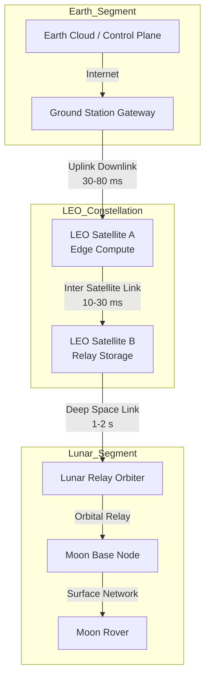
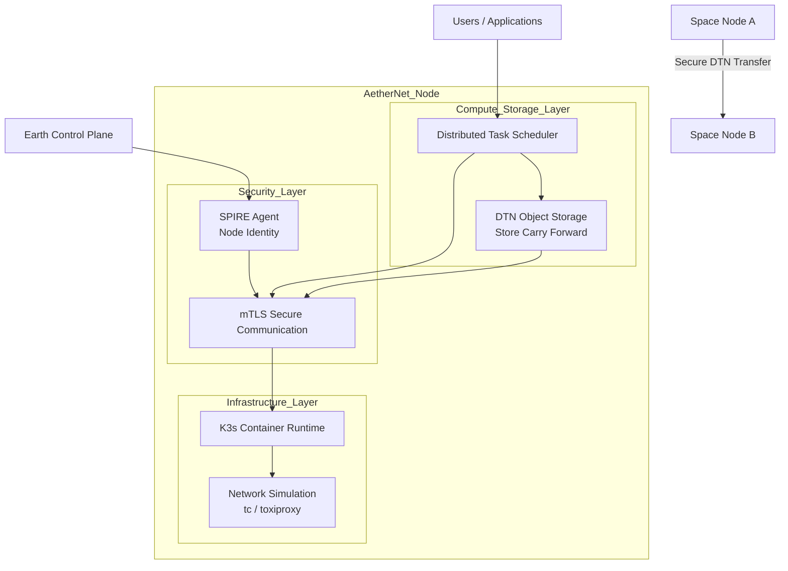
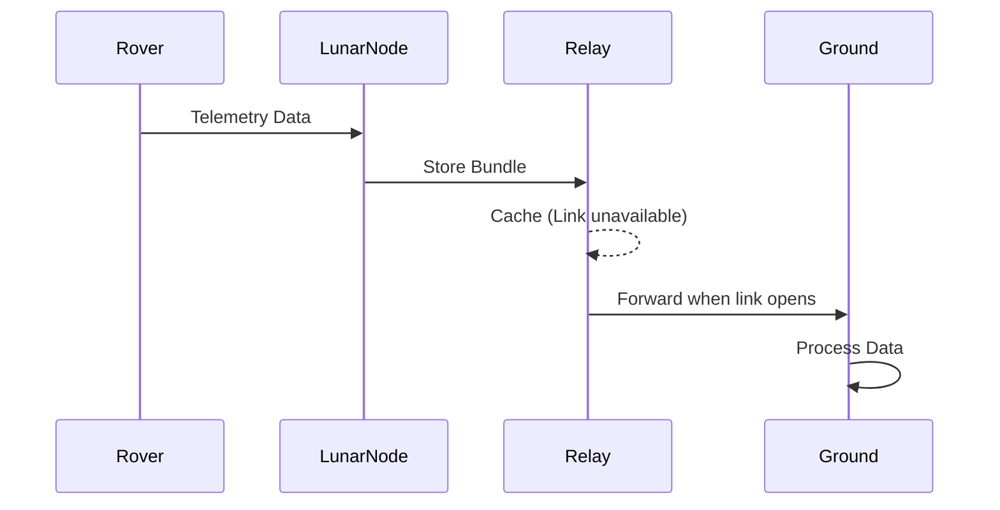

# AetherNet

**A Secure Delay-Tolerant Distributed Infrastructure Prototype for Space Networks**

## Project Purpose
AetherNet explores how to build a secure, contact-aware, delay-tolerant message infrastructure for space-like environments with intermittent connectivity and long delays.

### AetherNet vs LunarNet
- **AetherNet**: The core platform and simulation architecture.
- **LunarNet**: The reference deployment scenario using an `Earth ↔ LEO ↔ Moon` topology.

## MVP Scope (through Wave 8)
This repository provides a highly repeatable, application-layer DTN experimental platform with:
- ✅ **Contact-Aware Forwarding**: Bundles move only during valid orbital windows.
- ✅ **Store-Carry-Forward**: Filesystem-backed DTN store prevents data loss during link outages.
- ✅ **Strict Priority Delivery**: Telemetry is forwarded ahead of Science data.
- ✅ **Data Retention & Expiry**: Expired bundles are skipped during forwarding and periodically purged from the DTN store.
- ✅ **Experimental Scenarios**: Built-in profiles (e.g., delayed delivery, expiry before contact).
- ✅ **End-of-Run Reporting & Analytics**: Machine-readable JSON reports, multi-scenario comparisons, and derived metrics (e.g., delivery ratios, outcome classifications).

## Current Non-Goals
Intentionally out of scope for the MVP:
- Real network transport (HTTP, gRPC, TCP/UDP data plane)
- Distributed task scheduling / Kubernetes (K3s)
- Orbital mechanics or RF-layer simulation
- Database-backed persistence

## Running Experiments

**Run a single scenario and export the report:**
```bash
./scripts/run_demo.sh --scenario delayed_delivery --report-out artifacts/reports/delayed_delivery.json
```

Run all built-in scenarios and generate an aggregate comparison:

```
./scripts/run_compare.sh
```
Outputs will be securely written to the `artifacts/` directory. See `docs/artifacts.md` for details.

##  Testing

Run the test suite from the repository root:

```bash
export PYTHONPATH=$(pwd)
pytest tests/
```


---

System Topology



AetherNet Node Architecture



Data Flow


