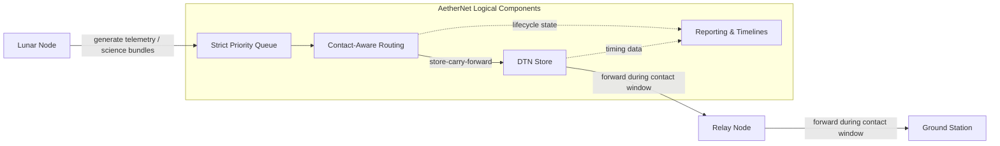
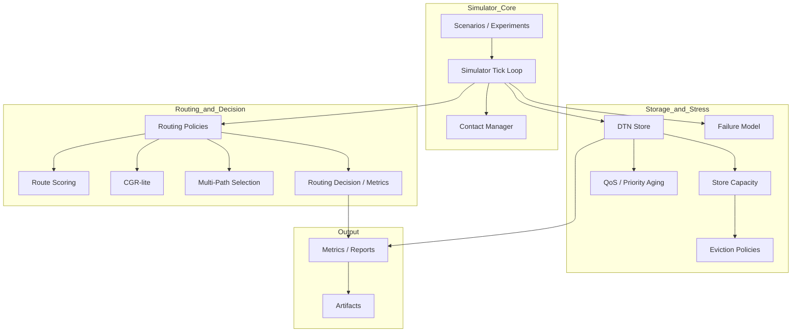
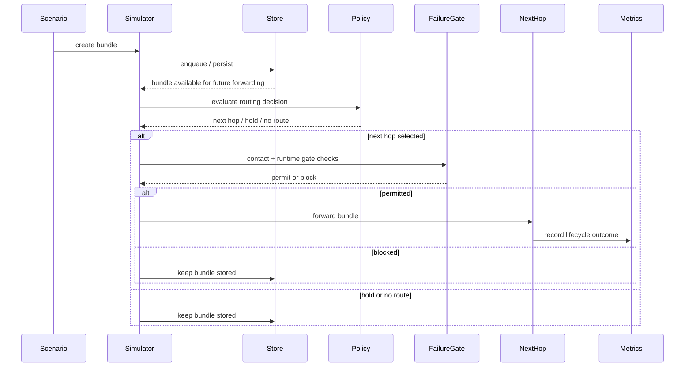

# AetherNet

**A Secure Delay-Tolerant Distributed Infrastructure Prototype for Space Networks**

> **Current status:** Phase-4 baseline completed.  
> AetherNet now includes transport reliability, routing intelligence, storage-pressure modeling, opportunistic routing, failure / partition modeling, and bounded multi-path candidate selection.


---

## What AetherNet Is

AetherNet is a **deterministic DTN simulation and experimentation platform** for space-like networks with:

- intermittent connectivity
- long delay
- store-carry-forward forwarding
- relay storage pressure
- routing-policy experimentation
- resilience / outage modeling

It is designed for:

- DTN routing research
- contact-aware forwarding experiments
- stress / resilience simulations
- artifact-driven comparison workflows
- future AI-agent and engineer handoff continuity

---

## What Has Been Implemented

### Phase-1 / Phase-2 / Phase-2.2 foundation

- simulator clock and scenario execution
- contact-window-driven forwarding
- strict priority queue
- store-carry-forward persistence
- fragmentation and reassembly
- retransmission / custody helpers
- experiment runner
- reports, visualization specs, and artifact export

### Phase-3 routing layer

- routing policy abstraction
- static routing baseline
- contact-aware routing
- route scoring for multi-candidate ranking
- CGR-lite bounded future-contact reasoning
- routing decision observability and routing metrics

### Phase-4 stress / resilience layer

- finite storage and congestion-control baseline
- QoS service differentiation and priority aging
- storage-pressure modeling with deterministic eviction policies
- opportunistic hold-vs-forward routing baseline
- deterministic failure / partition modeling
- bounded multi-path candidate selection

## Built-in Reference Scenarios

AetherNet ships with deterministic reference scenarios that are used for baseline validation, README examples, and regression testing.

### `default_multihop`

Baseline multi-hop forwarding scenario.

Purpose:

- validate store-carry-forward delivery across multiple hops
- demonstrate the default deterministic forwarding path
- serve as the simplest end-to-end reference scenario

Typical behavior:

- bundle is created at the source
- forwarded through one or more relay nodes
- successfully delivered to the destination if contacts remain available

### `delayed_delivery`

Contact-delayed forwarding scenario.

Purpose:

- validate that bundles are held when no current contact is open
- demonstrate delayed forwarding once a future contact becomes available
- confirm that the simulator preserves deterministic hold-then-forward behavior

Typical behavior:

- bundle is generated before the required link opens
- router/store holds the bundle
- delivery occurs later when the scheduled contact window becomes active

### `expiry_before_contact`

TTL-expiry-before-contact scenario.

Purpose:

- validate that expired bundles are not forwarded
- confirm that TTL enforcement remains deterministic
- demonstrate expiration behavior when delivery opportunities arrive too late

Typical behavior:

- bundle is created with a TTL shorter than the next usable contact
- bundle remains undelivered
- simulator marks the bundle as expired before forwarding can occur

---

## Repository Mental Model

The easiest way to understand the project is:

```text
Phase-1 / 2 / 2.2 = transport core
Phase-3            = routing brain
Phase-4            = stress / resilience shell
Phase-5            = planned experiment scalability layer
```

---

## Architecture Overview

AetherNet models a delay-tolerant multi-hop path across a simplified reference topology:

- `lunar-node`
- `leo-relay`
- `ground-station`

Bundles are generated at the lunar node, prioritized by bundle type, stored during disconnected periods, and forwarded only when contact windows are open.



For additional architecture documentation, see:

- `docs/architecture.md`
- `docs/system-sequence.md`

## High-Level Architecture



---

## Runtime Lifecycle



For the detailed step-by-step sequence, see:

- `docs/system-sequence.md`

---

## Core Source Areas

### Routing / decision logic

```text
router/routing_policies.py
router/contact_graph.py
router/route_scoring.py
router/routing_decision.py
metrics/routing_metrics.py
```

### Storage / stress / resilience

```text
router/store_capacity.py
router/eviction_policy.py
router/qos.py
router/failure_model.py
metrics/congestion_metrics.py
```

### Transport / simulation

```text
protocol/
sim/
store/
bundle_queue/
```

### Documentation / handoff

```text
README.md
docs/roadmap.md
docs/system-sequence.md
docs/phase-2-whitepaper.md
docs/phase-2-2-whitepaper.md
docs/phase-3-4-whitepaper.md
```

---

## Quickstart

### 1. Environment setup

AetherNet requires Python 3.10+.

```bash
python3 -m venv .venv
source .venv/bin/activate
make setup-dev
```

### 2. Smoke validation

```bash
make smoke
```

### 3. Run a demo scenario

```bash
make demo
```

or:

```bash
./scripts/run_demo.sh
```

### 4. Run all built-in comparisons

```bash
make compare
```

or:

```bash
./scripts/run_compare.sh
```

Generated outputs are written under `artifacts/`.

### 5. Run tests

```bash
make test
```

or:

```bash
pytest tests/
```

---

## Current Recommended Reading Order for Handoff

If you are a new engineer or AI agent, read these in order:

1. `README.md`
2. `docs/roadmap.md`
3. `docs/system-sequence.md`
4. `docs/phase-3-4-whitepaper.md`
5. `docs/phase-2-2-whitepaper.md`

This order gives you:

- repository overview
- milestone / wave context
- runtime lifecycle
- Phase-3 / Phase-4 implementation meaning
- earlier transport / artifact context

---

## What Is Intentionally Not Here Yet

The following are still out of scope or only partially modeled:

- real network transport planes
- orbital mechanics / RF-layer simulation
- uncontrolled replicated multipath execution
- probabilistic reliability models
- large-scale parameter sweep engine
- paper-ready benchmark packaging

Those belong to later roadmap phases.

---

## Next Recommended Roadmap Direction

The next major work should focus on **Phase-5 experiment scalability**, not random new policy complexity.

Recommended next sequence:

```text
Wave-49 scenario generator
Wave-50 parameter sweep engine
Wave-51 routing comparison framework
Wave-52 paper-ready experiment pipeline
```

---

## Summary

AetherNet is now best understood as:

> a deterministic DTN routing-and-resilience experimentation core for space-network research.

It already supports meaningful research around:

- routing policy choice
- future-contact reasoning
- storage pressure
- opportunistic waiting
- outage / partition recovery
- bounded path diversity

The next bottleneck is experiment scalability and reproducible comparison workflows.
