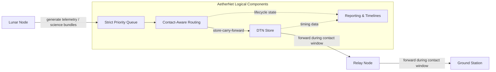
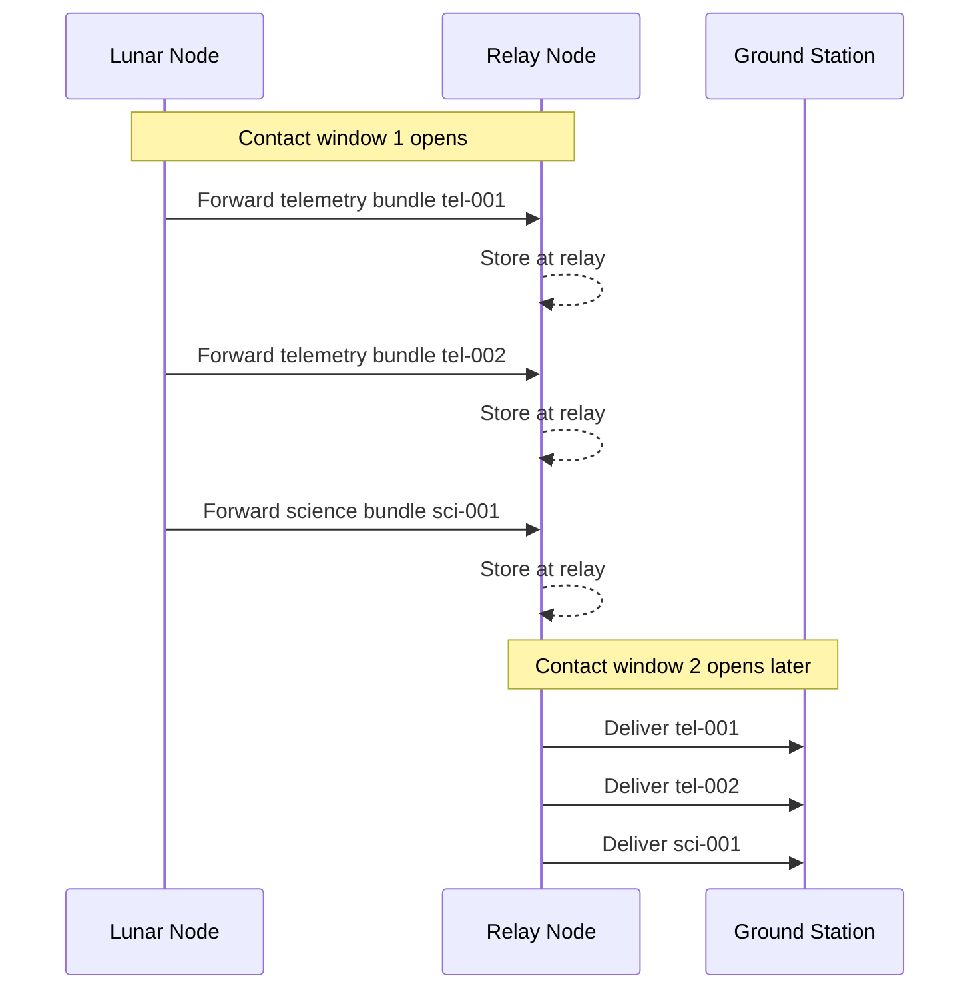
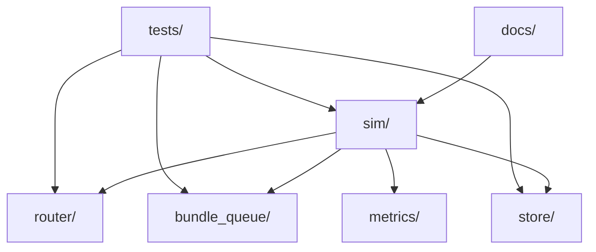

# AetherNet

**A Secure Delay-Tolerant Distributed Infrastructure Prototype for Space Networks**

> **🟩Status:** Phase-2 Transport Layer (Fragmentation + Reassembly) implemented.


## Project Purpose
AetherNet explores how to build a secure, contact-aware, delay-tolerant message infrastructure for space-like environments characterized by intermittent connectivity and extreme latency.

## AetherNet vs LunarNet
- **AetherNet**: the core platform, routing policies, and simulation architecture
- **LunarNet**: the reference deployment scenario using an `Earth ↔ LEO ↔ Moon` topology

---

## Architecture Overview


AetherNet models a delay-tolerant multi-hop path across a simplified reference topology:

- `lunar-node`
- `leo-relay`
- `ground-station`

Bundles are generated at the lunar node, prioritized by bundle type, stored during disconnected periods, and forwarded only when contact windows are open.



> Phase-2 adds deterministic fragmentation and destination-side reassembly to the transport pipeline.

## High Level Data Flow Example

The following sequence demonstrates how Strict Priority and Store-Carry-Forward mechanisms interact across intermittent contact windows:


> This example shows two contact windows: a first hop from lunar node to relay, followed by a later second hop from relay to ground station.



## Phase-2 Transport Lifecycle

In Phase-2, AetherNet extends the DTN pipeline to support **bundle fragmentation and reassembly**, allowing large bundles to traverse multi-hop paths across intermittent contact windows.

The simplified lifecycle is:

```
Bundle Created
↓
Fragmentation
↓
Strict Priority Queue
↓
DTN Store
↓
Contact Window Opens
↓
Multi-hop Forwarding
↓
Fragment Buffering
↓
Reassembly
↓
Bundle Delivered
```


This lifecycle models how bundles survive disconnections and traverse the network using **store-carry-forward routing**.

For the full system-level sequence diagram and detailed explanation, see: `docs/system-sequence.md`


## Repository Structure


---

## Built-in Scenarios
AetherNet currently includes three reference scenarios intended to demonstrate the core Phase-1 DTN behaviors of the platform:

- `default_multihop` — normal multi-hop delivery with telemetry prioritized ahead of science traffic.
- `delayed_delivery` — successful delivery with a significantly delayed second contact window (proving relay storage capabilities).
- `expiry_before_contact` — a short-lived telemetry bundle expires before a usable contact window opens (proving retention and garbage collection).

## Quickstart

### 1. Environment setup
AetherNet requires Python 3.10+.
```bash
python3 -m venv .venv
source .venv/bin/activate
make setup-dev
```

### 2. Local Validation (Smoke Test)
Run the smoke test to ensure core paths are intact before pushing changes:
```bash
make smoke
```

### 3. Run Experiments
**Run a single scenario (Makefile shortcut):**
```bash
make demo
```
**Run a single scenario :**

```bash
./scripts/run_demo.sh
```


**Run all built-in scenarios (Makefile shortcut):**
```bash
make compare
```
*Generated outputs are written under `artifacts/`. See `docs/artifacts.md` for details.*

**Run all built-in scenarios (Makefile shortcut):**

```bash
./scripts/run_compare.sh
```

### 4. Run tests

Using the Makefile:

```bash
make test
```

Directly with pytest:

```bash
pytest tests/
```


## Developer Ergonomics & CI
The project uses a lightweight `Makefile` as a convenience wrapper and tracks developer dependencies via `requirements-dev.txt`. A minimal GitHub Actions workflow is included to automatically validate pull requests. 

For more details on contributing and interpreting the architecture, see:
- `docs/development.md`
- `docs/architecture.md`
- `docs/reports.md`

## Current Limitations / Non-Goals
The following remain intentionally out of scope for the current MVP:
- real network transport (HTTP, gRPC, TCP/UDP data plane)
- distributed task scheduling or Kubernetes/K3s orchestration
- orbital mechanics or RF-layer physical simulation
- database-backed persistence
- production observability stack


## Demo

Run the built-in AetherNet scenarios:

```bash
make compare
```

This produces scenario reports under:

```
artifacts/reports/
```

Example delivery timeline:

```
tel-001 delivered at tick 15
tel-002 delivered at tick 16
sci-001 delivered at tick 17
```

See:
- `docs/demo.md`
- `docs/artifacts.md`

---


## Project Status

AetherNet currently consists of two major development phases.

### Phase-1 (Core DTN Simulator)

Phase-1 implemented the foundational DTN architecture:

* bundle lifecycle model
* strict priority scheduling
* store-carry-forward routing
* contact-aware transmission windows
* multi-hop relay simulation
* metrics and reporting infrastructure

These capabilities allow AetherNet to simulate basic delay-tolerant routing across intermittent contact windows.

### Phase-2 (Fragmentation & Reassembly)

Phase-2 extends the simulator with transport-layer realism:

* deterministic bundle fragmentation
* fragment metadata tracking
* fragment buffering at destination nodes
* automatic bundle reassembly
* integration with simulator delivery lifecycle

This enables the simulator to model the transport of large bundles across constrained contact windows.

Technical details of Phase-2 can be found in:

```
docs/phase-2-whitepaper.md
```

