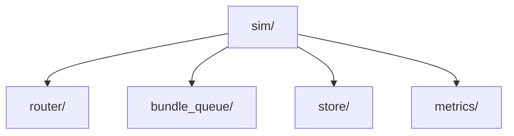

# AetherNet Architecture Overview

AetherNet is designed to solve data transmission challenges in extreme environments where traditional TCP/IP models fail due to high latency, asymmetric bandwidth, and frequent, predictable link disruptions.

## Reference Topology
We validate AetherNet against the "LunarNet" reference topology, an `Earth ↔ LEO ↔ Moon` configuration:
1. **Lunar Node (`lunar-node`)**: Generates scientific payloads and mission-critical telemetry.
2. **LEO Relay (`leo-relay`)**: Acts as a staging ground, storing data safely when the Earth link is down.
3. **Ground Station (`ground-station`)**: The final destination for all bundles.

## Core Software Components
The repository is strictly modularized to enforce separation of concerns:

* `sim/` orchestrates time and scenario execution
* `router/` contains contact-aware routing logic
* `bundle_queue/` defines forwarding priority
* `store/` persists bundle metadata
* `metrics/` and reporting summarize run behavior

### 1. Contact Manager (`router/contact_manager.py`)
Acts as the source of truth for orbital mechanics (abstracted). It dictates exactly *when* a link between two nodes is up. The simulator will never attempt to dequeue or forward a bundle if the Contact Manager reports a link as down.

### 2. Strict Priority Queue (`bundle_queue/`)
In constrained space networks, not all data is equal. This queue guarantees that high-priority `telemetry` bundles will always be forwarded before lower-priority `science` data, even if the science data arrived first. It also performs Just-In-Time (JIT) TTL checks, silently dropping expired bundles during dequeue operations.

### 3. DTN Store (`store/`)
Implements the "Store-Carry-Forward" paradigm. Instead of dropping packets when a link goes down (like traditional routers), AetherNet transitions bundles into a `STORED` state and safely persists them to the filesystem. A background retention job periodically purges expired metadata from the store to prevent storage exhaustion.

### 4. Simulator & Reporting (`sim/`)
The orchestration layer. It drives the virtual simulation clock (avoiding brittle `time.sleep` calls), evaluates forwarding opportunities at every tick, and compiles detailed JSON reports containing derived timing metrics (e.g., `delivery_span_ticks`, `relay_storage_observed`).