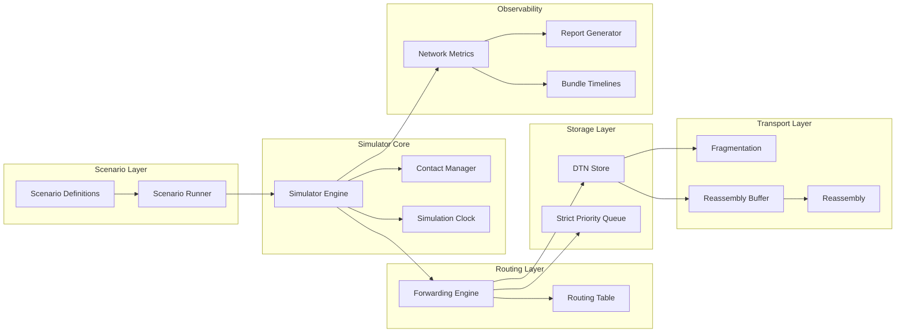
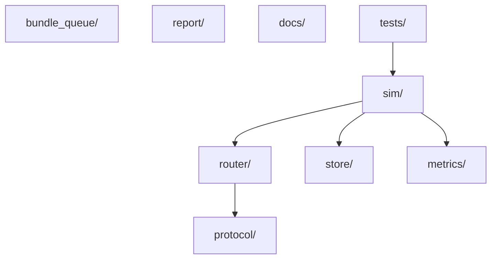

# AetherNet Architecture Diagram

## System Architecture Overview

This document describes the **internal architecture of AetherNet** after completion of **Phase-2 (Wave-25)**.

AetherNet is designed as a **modular delay-tolerant networking (DTN) simulation platform**, allowing researchers to explore routing, storage, fragmentation, and delivery behaviors under intermittent connectivity.

The architecture intentionally separates concerns into multiple layers.

---

# 1. High-Level System Layout



---

# 2. Layered Architecture

AetherNet follows a **layered architecture**, where each layer handles a specific aspect of DTN behavior.

| Layer         | Responsibility                                    |
| ------------- | ------------------------------------------------- |
| Scenario      | defines experiments and simulation configurations |
| Simulator     | executes contact windows and forwarding           |
| Routing       | determines next-hop decisions                     |
| Transport     | fragmentation and reassembly                      |
| Storage       | bundle persistence and queueing                   |
| Observability | metrics, reports, experiment outputs              |

---

# 3. Core Modules

Below is a breakdown of the major modules in the repository.

---

# Simulator Layer

Location:

```text
sim/
```

Responsible for running the simulation engine.

Key components:

```text
Simulator
SimulationClock
ContactManager
Scenario Runner
```

Responsibilities:

```text
execute simulation ticks
open and close contact windows
trigger bundle forwarding
record lifecycle events
```

Primary file:

```text
sim/simulator.py
```

---

# Routing Layer

Location:

```text
router/
```

Handles routing logic and forwarding decisions.

Key modules:

```text
router/bundle.py
router/forwarding_engine.py
router/routing_table.py
```

Responsibilities:

```text
bundle lifecycle state
forwarding state transitions
next-hop determination
routing policy
```

Bundle states:

```text
QUEUED
STORED
FORWARDING
DELIVERED
EXPIRED
FAILED
```

---

# Transport Layer

Location:

```text
protocol/
```

Introduced in **Phase-2**.

This layer handles fragmentation and reassembly.

---

## Fragmentation

File:

```text
protocol/fragmentation.py
```

Responsibility:

```text
split large bundles into deterministic fragments
```

Fragment metadata:

```text
is_fragment
original_bundle_id
fragment_index
total_fragments
```

Fragment naming convention:

```text
bundle_id.frag-0
bundle_id.frag-1
bundle_id.frag-2
```

---

## Reassembly

File:

```text
protocol/reassembly.py
```

Responsibilities:

```text
validate fragment sets
reconstruct original bundle
ensure metadata consistency
```

Key APIs:

```python
can_reassemble(fragments)
reassemble_bundle(fragments)
```

---

## Reassembly Buffer

File:

```text
protocol/reassembly_buffer.py
```

Purpose:

Temporarily stores fragments arriving at destination nodes.

Structure:

```text
original_bundle_id → fragment list
```

Example:

```text
{
  "sci-001": [frag0, frag1, frag2]
}
```

Reassembly is triggered when the fragment set is complete.

---

# Storage Layer

Location:

```text
store/
bundle_queue/
```

This layer implements **store-carry-forward behavior**.

---

## Strict Priority Queue

File:

```text
bundle_queue/priority_queue.py
```

Responsibilities:

```text
bundle scheduling
priority ordering
expired bundle filtering
```

Bundle types may have different priorities:

```text
telemetry
science
```

---

## DTN Store

File:

```text
store/store.py
```

Responsibilities:

```text
persist bundle state
store bundles during disconnection
retrieve bundles for forwarding
```

This simulates a node's local storage.

---

# Observability Layer

Location:

```text
metrics/
reports/
analysis/
```

This layer provides experiment outputs.

---

## Network Metrics

File:

```text
metrics/network_metrics.py
```

Tracks:

```text
bundles forwarded
bundles stored
bundles delivered
bundle lifecycle timing
```

---

## Report Generation

File:

```text
report/report_export.py
```

Produces experiment outputs under:

```text
artifacts/reports/
```

Example metrics:

```text
delivery latency
bundle timelines
forwarding counts
```

---

# 4. Bundle Lifecycle

The complete bundle lifecycle in Phase-2:

```mermaid
flowchart LR

    CREATE[Bundle Created]
    FRAG[Fragmentation]
    QUEUE[Priority Queue]
    STORE[DTN Store]
    CONTACT[Contact Window]
    HOP[Multi-Hop Forwarding]
    BUFFER[Fragment Buffer]
    REASS[Reassembly]
    DELIVER[Bundle Delivered]

    CREATE --> FRAG
    FRAG --> QUEUE
    QUEUE --> STORE
    STORE --> CONTACT
    CONTACT --> HOP
    HOP --> BUFFER
    BUFFER --> REASS
    REASS --> DELIVER
```



---

# 5. Repository Layout

Current repository layout:



---

# 6. Phase-2 Architecture Changes

Phase-2 introduced three new modules:

```text
protocol/fragmentation.py
protocol/reassembly.py
protocol/reassembly_buffer.py
```

These modules extend the DTN pipeline to support **fragment transport and reconstruction**.

Integration point:

```text
Simulator._process_hop()
```

Fragments reaching their destination are intercepted and buffered until a full set can be reconstructed.

---

# 7. Design Principles

AetherNet follows several architectural principles.

---

### Deterministic Behavior

All core algorithms are deterministic:

```text
fragment ordering
fragment naming
routing decisions
report generation
```

This allows experiments to be reproducible.

---

### Modular Layers

Routing, transport, storage, and simulation are separated.

This enables independent evolution of:

```text
routing algorithms
transport policies
simulation models
```

---

### Minimal Integration

Fragmentation and reassembly are implemented as **protocol helpers**, avoiding major modifications to the simulator core.

This design allows incremental upgrades.

---

# 8. Future Architecture Extensions

Planned architectural extensions include:

```text
contact-aware fragmentation
custody transfer
fragment retransmission
fragment garbage collection
experiment orchestration
visualization pipelines
```

These changes are described in:

```text
docs/roadmap.md
```

---

# 9. Summary

After completion of Phase-2, AetherNet supports a full DTN transport lifecycle:

```text
bundle creation
fragmentation
store-carry-forward routing
multi-hop forwarding
destination reassembly
experiment reporting
```

The platform is now positioned as a **research-grade DTN simulation environment** capable of supporting deeper exploration of space networking architectures.

---
