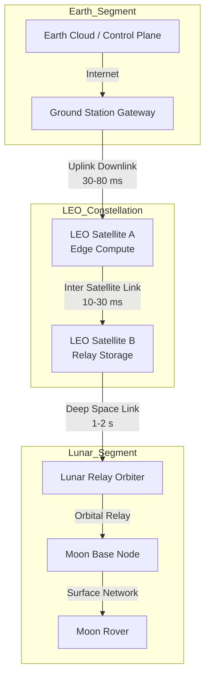
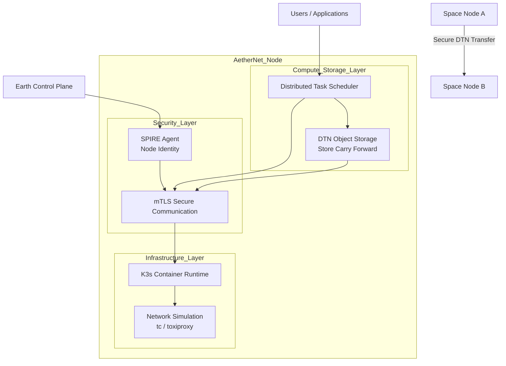
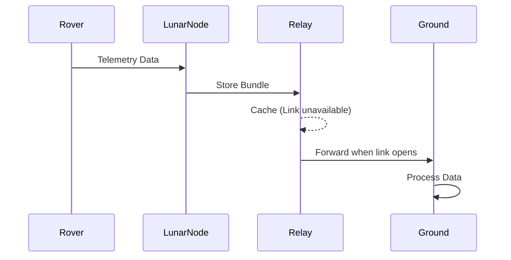

# AetherNet + LunarNet: High-Level Design Document (HLD)

**Project Name:** AetherNet - A Zero Trust Distributed Infrastructure for Space Networks
**Extension:** LunarNet
**Date:** 2026-03-11
**Version:** 0.1 (Draft)
**Author:** Kevin Liu
**Purpose:** Experimental architecture for secure distributed space infrastructure

---

System Topology



AetherNet Node Architecture



Data Flow




---

# 1. Background

The space industry is rapidly transitioning from **single-satellite missions** to **large-scale distributed space infrastructure**.

Examples include:

* SpaceX **Starlink**
* Amazon **Project Kuiper**
* ESA **Moonlight Program**
* NASA **Artemis and LunaNet**

Future space systems will consist of **hundreds or thousands of nodes** operating across:

```text
Earth ground stations
Low Earth Orbit (LEO) satellite constellations
Lunar relay satellites
Lunar surface nodes
```

Unlike terrestrial networks, space environments present several fundamental challenges:

* extremely high latency
* intermittent connectivity
* limited onboard compute resources
* increased cybersecurity risks

Traditional Internet protocols (e.g., TCP/IP) assume **stable and low-latency connections**, which are not guaranteed in deep-space communication environments.

To address these limitations, NASA proposed the **LunaNet architecture**, which aims to create a scalable and interoperable network for lunar exploration.

**AetherNet** is an experimental open-source platform designed to explore the architecture of a **space-native distributed computing and networking infrastructure**.

The project integrates:

* **cloud-native distributed systems**
* **delay-tolerant networking concepts**
* **Zero Trust security architectures**

to simulate and prototype future space network infrastructures.

---

# 2. Problem Definition

Designing a distributed network across Earth, orbit, and lunar environments introduces several key technical challenges.

---

## 2.1 Extreme Latency

Communication delays increase significantly with distance.

Typical latency ranges:

```text
Earth ↔ LEO:      ~30–80 ms
LEO ↔ LEO:        ~10–30 ms
Earth ↔ Moon:     ~1–2 seconds (one-way)
```

Traditional protocols relying on frequent handshakes become inefficient or unreliable in such environments.

---

## 2.2 Intermittent Connectivity

Satellite communication links are not continuously available due to:

* orbital movement
* limited line-of-sight
* relay satellite coverage windows

This requires a **store-carry-forward communication model** rather than continuous streaming.

---

## 2.3 Resource Constraints

Spaceborne systems operate under strict constraints:

* limited CPU and memory
* power limitations
* radiation-induced hardware faults

Distributed systems designed for space must therefore prioritize **lightweight orchestration and resilience**.

---

## 2.4 Security Risks

Space infrastructure is increasingly considered **critical infrastructure** and therefore becomes a target for cyber threats.

Potential attack vectors include:

* command spoofing
* telemetry manipulation
* rogue node injection
* compromised software supply chains

Traditional perimeter-based security models are insufficient for decentralized space networks.

A **Zero Trust architecture** is required to ensure that every node must be authenticated and verified before participating in the network.

---

# 3. Related Work

Several existing research initiatives and technologies influence the design of AetherNet.

---

## 3.1 NASA LunaNet

NASA's **LunaNet** architecture proposes a future lunar communication network that enables interoperability between lunar orbiters, surface assets, and Earth stations.

LunaNet emphasizes:

* service-based networking
* standardized communication interfaces
* scalable lunar infrastructure

However, its primary focus is communication interoperability rather than distributed compute infrastructure.

> https://ieeexplore.ieee.org/abstract/document/9172509

---

## 3.2 CCSDS Delay-Tolerant Networking

The **Consultative Committee for Space Data Systems (CCSDS)** developed Delay-Tolerant Networking (DTN) protocols for deep-space communication.

The **Bundle Protocol (BPv7)** is designed to support:

* intermittent connectivity
* long communication delays
* disrupted networks

Key DTN principles include:

```text
Store
Carry
Forward
```

These concepts inspire the **DTN Object Storage layer** within AetherNet.

---

## 3.3 Distributed Cloud Infrastructure

Modern cloud infrastructures use distributed orchestration systems to manage compute resources across clusters.

Examples include container orchestration and distributed scheduling systems.

AetherNet extends these ideas to environments with:

* unstable connectivity
* extreme latency
* autonomous edge nodes.

---

## 3.4 SPIFFE / SPIRE Identity Framework

SPIFFE provides cryptographically verifiable identities for distributed systems.

SPIRE is the runtime implementation responsible for issuing and rotating secure identities.

In AetherNet, these technologies enable **Zero Trust authentication between space nodes**.

---

# 4. High-Level Architecture

AetherNet models a distributed infrastructure spanning Earth, orbital satellites, and lunar nodes.

```text
Earth Cloud / Ground Station
        |
        |
   LEO Satellite Constellation
        |
        |
     Lunar Relay
        |
        |
   Lunar Surface Nodes
```

Each node runs a common software stack composed of several modular components.

---

## 4.1 Network Simulation Layer

Responsible for simulating real-world space network characteristics.

Capabilities include:

* latency simulation
* packet loss
* bandwidth constraints
* dynamic link availability

This allows realistic testing of distributed protocols under space-like conditions.

---

## 4.2 DTN Object Storage Layer

Implements a **store-carry-forward data storage model**.

Features include:

* local caching of data bundles
* delayed synchronization
* opportunistic forwarding when links become available

This layer ensures data persistence despite intermittent connectivity.

---

## 4.3 Distributed Compute Scheduler

Provides a lightweight distributed job scheduling mechanism.

Responsibilities include:

* distributing tasks across nodes
* collecting results
* retrying failed tasks
* handling node unavailability

Example workloads may include:

* satellite image analysis
* telemetry processing
* anomaly detection.

---

## 4.4 Zero Trust Security Layer

All communication between nodes is secured using identity-based authentication.

Key properties:

* each node has a cryptographic identity
* all connections require mutual TLS
* unauthorized nodes cannot join the network

This ensures secure communication across an untrusted environment.

---

# 5. Technology Stack

The technology stack is chosen to balance **simplicity, realism, and rapid prototyping**.

| Layer            | Technology              | Reason                                                        |
| ---------------- | ----------------------- | ------------------------------------------------------------- |
| Containerization | Docker / K3s            | lightweight cluster simulation suitable for edge environments |
| Networking       | Linux `tc` / Toxiproxy  | simulate latency, packet loss, and network disruption         |
| Compute          | Python + gRPC           | fast development and efficient RPC communication              |
| Storage          | Custom DTN Object Store | supports store-carry-forward behavior                         |
| Identity         | SPIFFE / SPIRE          | Zero Trust node identity and automated certificate management |
| Monitoring       | Prometheus + Grafana    | observability and system metrics                              |

---

# 6. Threat Model

AetherNet assumes the presence of potential adversarial behavior in the network.

Threat scenarios include:

* rogue nodes attempting to join the network
* telemetry data tampering
* unauthorized command injection
* compromised relay nodes
* supply chain attacks targeting node software

Security goals include:

```text
strong cryptographic identity
secure communication channels
authenticated task scheduling
data integrity protection
```

The system adopts **Zero Trust principles**, meaning:

```text
no node is trusted by default
all nodes must continuously prove their identity
```

---

# 7. Minimum Viable Prototype (MVP)

To ensure practical development within a short timeframe (approximately 3 months), the MVP focuses on a minimal functional topology.

---

## MVP Topology

The system simulates three nodes:

```text
ground-station
       |
leo-satellite-relay
       |
lunar-node
```

This topology is sufficient to demonstrate:

* DTN data forwarding
* distributed scheduling
* secure node authentication.

---

## MVP Components

### Network Simulation

Simulate space network conditions:

* latency injection
* temporary link outages
* packet loss

---

### DTN Storage

Implement basic **store-carry-forward logic**:

1. Data generated at lunar node
2. Relay satellite temporarily cannot reach Earth
3. Data stored locally
4. When link becomes available, data forwarded

---

### Distributed Task Scheduler

Simple job distribution mechanism:

* send processing task to relay node
* relay processes data
* results returned to ground station

---

### Zero Trust Identity

All nodes must authenticate using SPIFFE identities.

Example scenario:

* trusted nodes communicate successfully
* unauthorized node attempts to join network
* connection rejected.

---

## Example Demo Scenario

1. The lunar node generates telemetry data.
2. The relay satellite temporarily cannot reach the ground station.
3. Data is cached locally in the DTN object store.
4. The communication window opens.
5. Data is forwarded to the ground station.
6. Ground station receives and processes the telemetry.

---

# 8. Future Extensions

The architecture is intentionally designed to support future expansion.

---

## 8.1 Lunar Network Expansion

Additional nodes may include:

* lunar relay satellites
* lunar surface base
* rover communication systems

Topology example:

```text
Earth
 |
LEO constellation
 |
Lunar relay
 |
Moon base
 |
Moon rover
```

---

## 8.2 Orbital Simulation Integration

Future versions may include:

* orbital mechanics simulation
* dynamic satellite movement
* automatic relay selection.

---

## 8.3 Edge AI Processing

Satellite nodes may execute lightweight AI models for:

* anomaly detection
* image classification
* onboard data filtering.

This reduces bandwidth usage by transmitting only relevant information.

---

## 8.4 Hardware-in-the-Loop Simulation

Nodes could be deployed on embedded hardware platforms such as:

* Raspberry Pi
* edge computing boards

This allows simulation of real satellite resource constraints.

---

# 9. Conclusion

AetherNet explores the design of a **secure distributed infrastructure for future space networks**.

The system combines:

```text
distributed computing
delay tolerant networking
zero trust security
```

to simulate an experimental architecture capable of supporting:

* satellite constellations
* Earth–Moon communication
* autonomous space infrastructure

The MVP prototype validates the core architectural principles and provides a foundation for future research and experimentation in **space-native distributed systems**.

---
