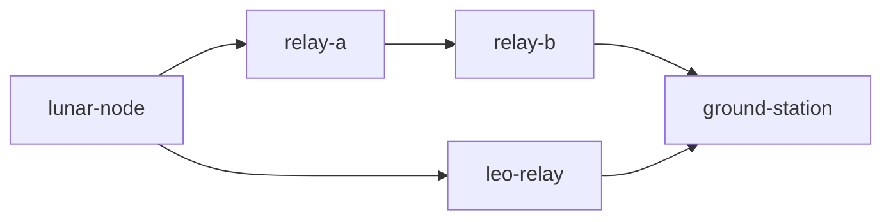
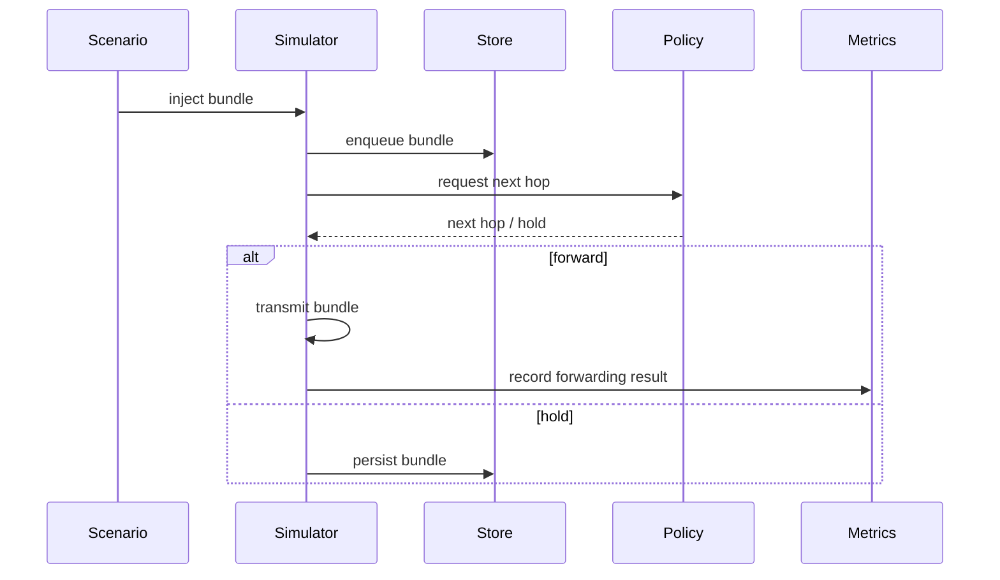
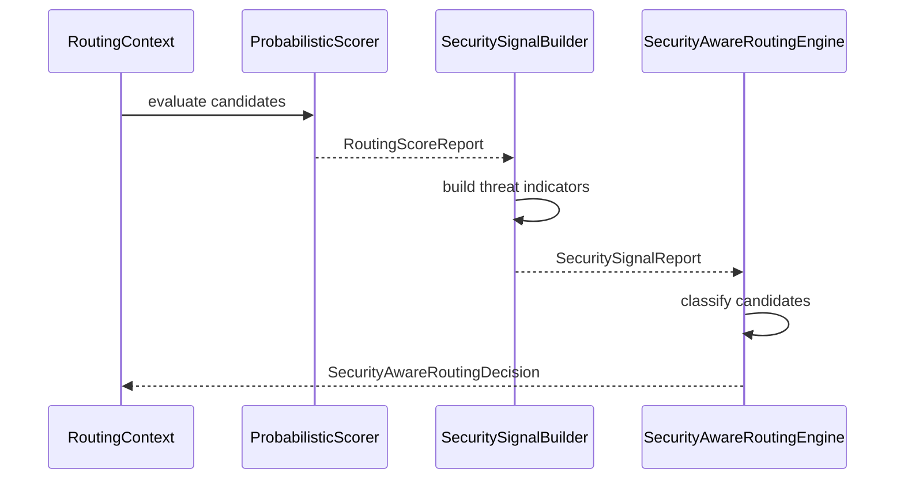
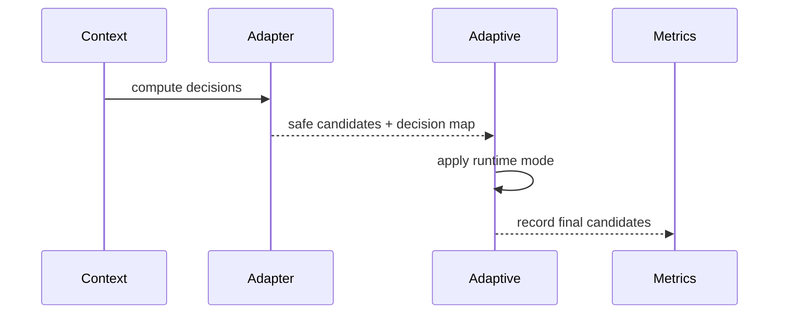
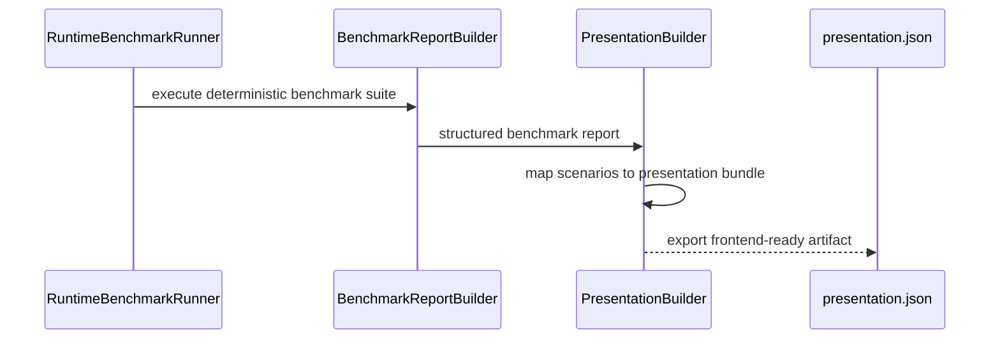
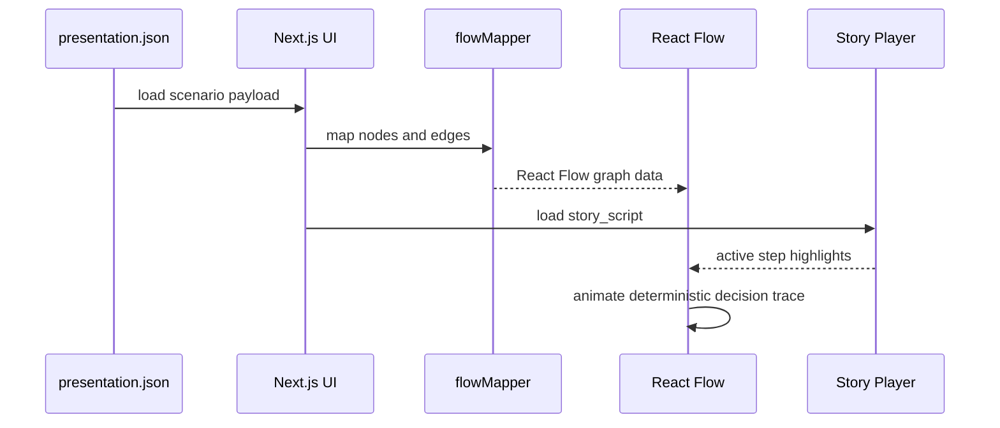
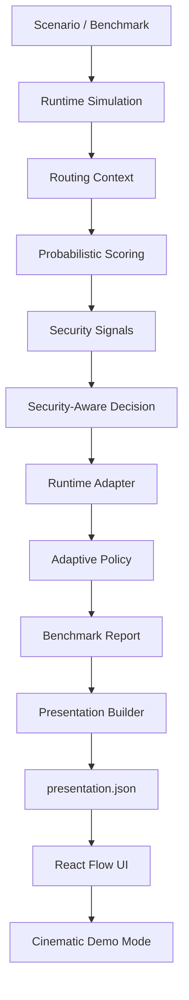

# AetherNet Architecture Overview

AetherNet is a **deterministic Delay-Tolerant Networking (DTN) simulation, decision, and visualization system** designed for:

- space-like intermittent connectivity
- long propagation delays
- constrained contact windows
- degraded or adversarial link conditions
- routing-policy experimentation
- explainable security-aware routing evaluation

It evolves from a simulator into a:

> **deterministic, security-aware routing decision and explanation platform**

---

## 1. High-Level Architecture

AetherNet is organized into five layers:

```text
Scenario / Benchmark Layer
    → defines deterministic network situations and comparison cases

Runtime Plane
    → executes DTN simulation and forwarding behavior

Decision Plane
    → evaluates candidate links and produces security-aware routing decisions

Presentation Plane
    → converts runtime and decision artifacts into frontend-ready JSON

Visualization Plane
    → renders routing decisions as an explainable React Flow demo
````

The core architectural principle is:

> **The backend decides. The frontend renders.**

The frontend does not infer routing behavior. It only visualizes deterministic backend-generated artifacts.

---

## 2. Reference Topology

AetherNet uses space-like reference topologies such as:



This topology models:

* lunar / remote node origin
* LEO or relay infrastructure
* multi-relay forwarding paths
* ground station endpoint
* intermittent or constrained contact opportunities

---

## 3. Scenario / Benchmark Layer

The scenario layer defines deterministic experiment inputs.

### Responsibilities

* define candidate links
* define degraded, jammed, or unsafe conditions
* define repeatable benchmark cases
* provide controlled comparison between routing policies

### Example Demo Scenarios

| Scenario     | Purpose                                      |
| ------------ | -------------------------------------------- |
| `clean`      | all routing modes converge                   |
| `degraded`   | degraded but usable path conditions          |
| `jammed`     | legacy and Phase-6 decisions diverge         |
| `mixed_risk` | mixed clean, degraded, and unsafe candidates |

The `jammed` scenario is the recommended public demo because it clearly shows legacy routing diverging from Phase-6 security-aware routing.

---

## 4. Runtime Plane — Phase 1 to Phase 5

The runtime plane simulates DTN behavior.

### Responsibilities

* bundle injection and propagation
* store-carry-forward persistence
* contact-aware forwarding
* queue scheduling and prioritization
* congestion and eviction
* failure and partition modeling
* report and artifact generation

### Core Modules

```text
sim/           → simulation orchestration
router/        → routing policies and forwarding decisions
bundle_queue/  → scheduling and priority handling
store/         → persistence and bundle lifecycle
protocol/      → bundle fragmentation and protocol helpers
metrics/       → reporting and telemetry collection
```

### Runtime Execution Flow



---

## 5. Decision Plane — Phase 6

The decision plane evaluates candidate links at a deterministic time snapshot.

It answers:

```text
Given the current routing context, which candidate links are preferred, allowed, or unsafe?
```

### Core Pipeline



### Output Classification

Each candidate link is classified as:

```text
preferred → safe / highest-quality candidate
allowed   → usable but degraded or lower-confidence candidate
avoid     → unsafe / adversarial candidate
```

### Design Properties

* deterministic
* complete candidate coverage
* explainable scoring
* replayable artifacts
* fail-fast validation
* no silent fallback on missing decision data

---

## 6. Runtime Control and Adaptive Layer — Phase 7

The adaptive layer bridges Phase-6 decision outputs into runtime-like candidate filtering behavior.

### Components

```text
Phase6DecisionAdapter
AdaptivePhase6Adapter
RoutingMetricsCollector
PolicyComparisonRunner
PolicyShowcaseBuilder
```

### Adaptive Flow



### Adaptive Modes

| Mode         | Behavior                                              |
| ------------ | ----------------------------------------------------- |
| Conservative | keep only preferred links if available                |
| Balanced     | preferred first, then allowed                         |
| Aggressive   | preserve original safe order; remove only avoid links |

### Boundary

The adaptive runtime layer is built and tested, but the main Phase-5 simulation loop does not yet globally enable Phase-6 adaptive routing by default.

---

## 7. Presentation Plane — Phase 8

The presentation plane converts deterministic backend outputs into frontend-ready artifacts.

This is the bridge between research/runtime logic and the React visualization UI.

### Components

```text
aether_phase6_presentation/
scripts/export_presentation_json.py
```

### Main Artifact

```text
presentation.json
```

This artifact contains:

* scenario metadata
* routing decisions
* topology metrics
* React Flow nodes
* React Flow edges
* story playback script
* narrative text
* conclusion summaries

### Presentation Export Flow



### Example Contract

```json
{
  "scenario_id": "jammed",
  "metrics": {
    "nodes": 5,
    "edges": 4,
    "modes": 3,
    "diverged": true
  },
  "decisions": {
    "legacy": "L2",
    "phase6_balanced": "L3",
    "phase6_adaptive": "L3"
  },
  "nodes": [],
  "edges": [],
  "story_script": []
}
```

---

## 8. Visualization Plane — React Flow Mission Control UI

The visualization layer renders `presentation.json`.

It is implemented as a local Next.js / React application.

### Responsibilities

* load `presentation.json`
* switch scenarios
* render routing decisions
* render topology metrics
* animate React Flow nodes and edges
* play deterministic story scripts
* support recording-ready presentation mode

### Important Rule

The visualization plane does **not** compute routing behavior.

It renders:

```text
backend-provided decisions
backend-provided nodes
backend-provided edges
backend-provided story_script
```

### Visualization Flow



---

## 9. End-to-End System Flow



---

## 10. Deterministic Contract

AetherNet enforces deterministic behavior across the stack.

For fixed inputs:

```text
ScenarioSpec / BenchmarkCase
Seed
TimeIndex
CandidateSet
Threat model
```

AetherNet should produce stable outputs for:

* routing context
* score report
* security signal report
* security-aware decision
* policy comparison result
* showcase report
* presentation bundle
* `presentation.json`

### Deterministic Guarantees

* same input produces same output
* stable ordering and serialization
* no hidden runtime randomness in adaptive modes
* no mutation leakage from exported artifacts
* frontend does not infer decisions
* story playback follows backend-generated `story_script`

---

## 11. Data / Artifact Boundary

AetherNet intentionally separates backend decision logic from frontend rendering.

```text
Backend:
    owns routing, scoring, signals, decisions, traces, and story structure

Frontend:
    owns layout, visualization, playback controls, and camera movement
```

This keeps the system testable and prevents frontend UI code from becoming a second routing implementation.

---

## 12. Current Demo Modes

### Standard Dashboard

```text
http://localhost:3000
```

Used for development and inspection.

Includes:

* scenario selector
* playback controls
* routing decisions panel
* topology metrics panel
* JSON export button
* React Flow graph

### Recording / Presentation Mode

```text
http://localhost:3000/?mode=presentation&clean=true&recording=true&scenario=jammed
```

Used for screen recording and external demonstration.

Includes:

* auto-start story playback
* clean fullscreen-style view
* hidden manual controls
* hidden data panels when `clean=true`
* expanded React Flow canvas
* narrative overlay

---

## 13. Source Area Map

### Runtime / Simulation

```text
sim/
protocol/
store/
bundle_queue/
```

### Routing / Decision Logic

```text
router/
metrics/
aether_phase6_runtime/
```

### Presentation Layer

```text
aether_phase6_presentation/
scripts/export_presentation_json.py
```

### Frontend Visualization

```text
aethernet-ui/
```

### Documentation

```text
docs/
```

---

## 14. Current Boundaries

AetherNet currently does **not**:

* operate as a production network controller
* ingest live satellite telemetry
* control real ground-station infrastructure
* perform online learning or reinforcement learning
* globally enable Phase-6 adaptive routing inside the full simulation loop by default
* compute full-scale multi-hop secure path optimization
* claim deployment in real satellite networks

The current system is best understood as:

> a deterministic research and engineering platform for explaining routing decisions under adversarial DTN-like conditions.

---

## 15. Evolution Path

```text
Simulator Core
→ Research Pipeline
→ Security-Aware Decision Layer
→ Runtime Bridge / Adaptive Showcase
→ Presentation Artifact Layer
→ Cinematic Explainability Demo
→ Live Simulation Integration
→ Multi-Hop Security-Aware Routing
```

---

## 16. Key Insight

AetherNet is not just a simulator.

It is:

> a deterministic system that can evaluate, compare, and explain routing decisions under adversarial DTN conditions.

The current `v0.8-cinematic-demo` release shows that the system can also make those decisions visible through a replayable, recording-ready visualization layer.

