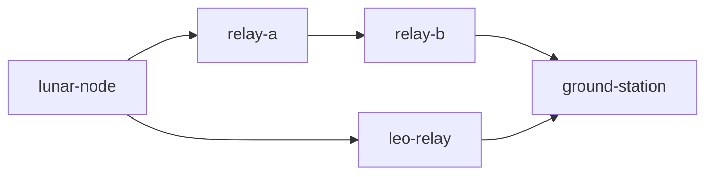
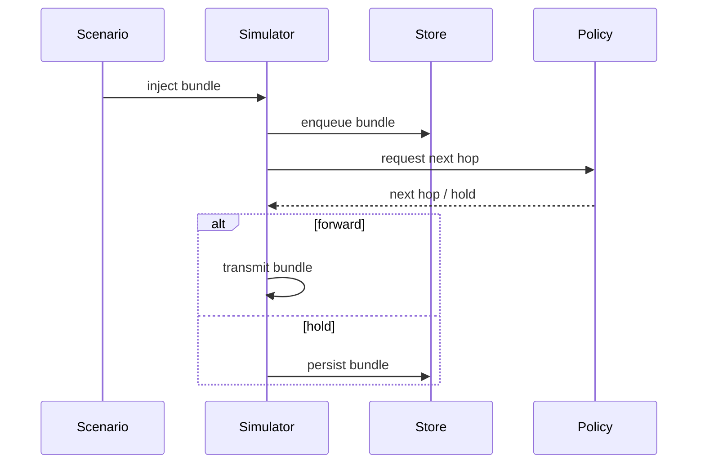
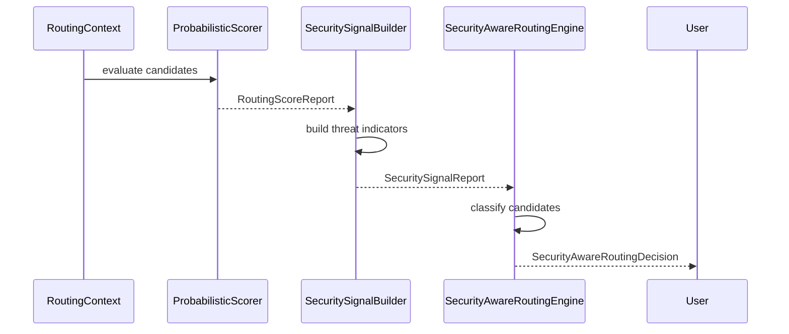
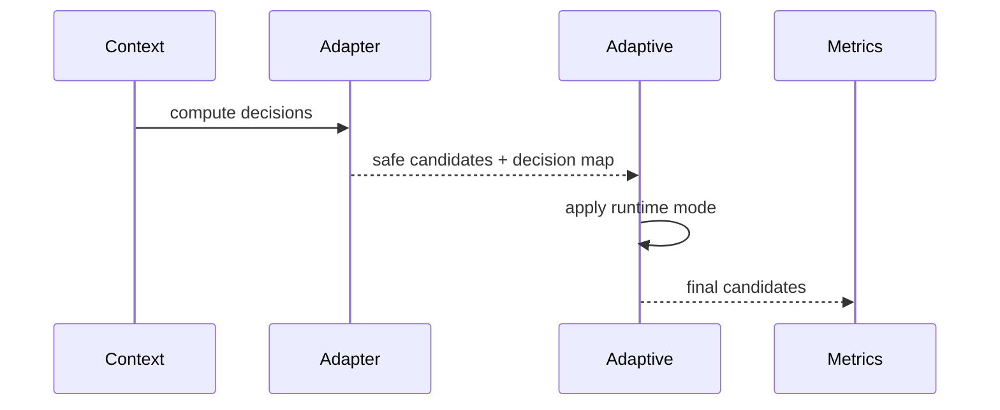
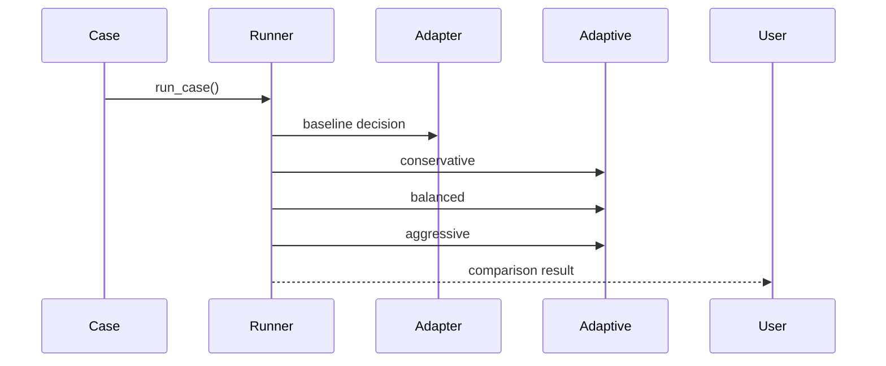
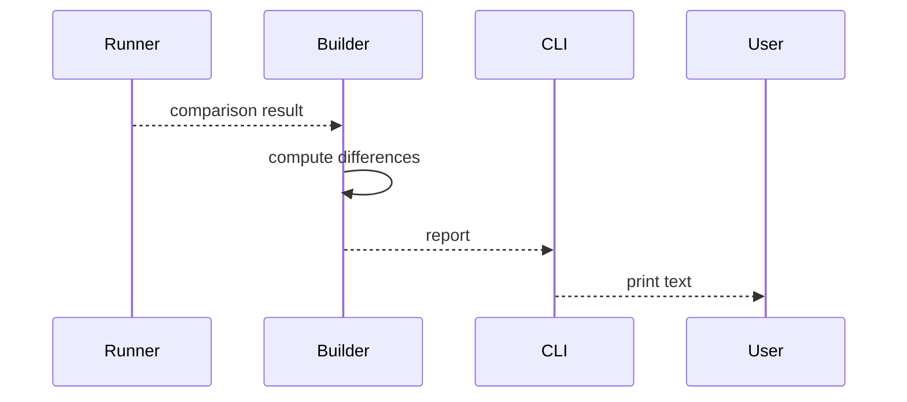
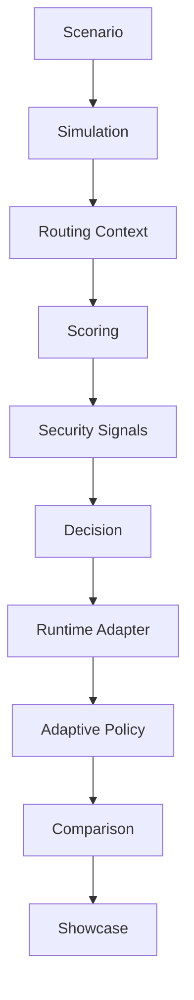

# AetherNet Architecture

AetherNet is a **deterministic Delay-Tolerant Networking (DTN) system** designed for:

- space-like intermittent connectivity
- long propagation delays
- adversarial and degraded network conditions
- routing policy experimentation and evaluation

It evolves from a simulator into a:

> **deterministic, security-aware routing decision and control system**

---

## 1. High-Level Architecture

AetherNet is composed of three primary planes:

```text
Runtime Plane
    → executes DTN simulation and forwarding

Decision Plane
    → evaluates network state and produces routing decisions

Runtime Control & Presentation Plane
    → applies decisions, adapts behavior, and generates outputs
````

---

## 2. System Topology (Reference)



This topology models:

* Earth ↔ LEO relay
* relay mesh
* ground station endpoint

---

## 3. Runtime Plane (Phase-1~5)

The runtime plane simulates DTN behavior:

### Responsibilities

* bundle injection and propagation
* store-carry-forward persistence
* contact-aware forwarding
* queue scheduling and prioritization
* congestion and eviction
* failure and partition modeling

---

### Core Modules

```text
sim/          → simulation orchestration
router/       → routing policies and forwarding decisions
bundle_queue/ → scheduling and priority handling
store/        → persistence and bundle lifecycle
```

---

### Execution Flow



---

## 4. Decision Plane (Phase-6)

The decision plane evaluates candidate links at a given time snapshot.

---

### Core Pipeline



---

### Output Model

Each candidate link is classified as:

```text
preferred → safe / optimal
allowed   → usable but degraded
avoid     → unsafe / adversarial
```

---

### Design Properties

* deterministic (seed-based)
* complete (all candidates classified)
* explainable (decision traceable)
* replayable (artifact-based)

---

## 5. Runtime Control & Adaptive Layer (Phase-7)

This layer bridges decision outputs into runtime-like behavior.

---

### Components

```text
Phase6DecisionAdapter
AdaptivePhase6Adapter
RoutingMetricsCollector
```

---

### Flow



---

### Adaptive Modes

#### Conservative

* keep only preferred links if available
* fallback to allowed if necessary

---

#### Balanced

* preferred first, then allowed
* avoid removed

---

#### Aggressive

* preserve original candidate order
* remove only avoid links

---

## 6. Policy Comparison Layer (Wave-93)

Enables deterministic comparison across runtime strategies.

---

### Components

```text
PolicyComparisonCase
PolicyComparisonRunner
PolicyComparisonResult
```

---

### Flow



---

## 7. Presentation / Showcase Layer (Wave-94~95)

Transforms comparison results into human-readable artifacts.

---

### Components

```text
PolicyShowcaseBuilder
PolicyShowcaseReport
scripts/run_phase6_showcase.py
```

---

### Flow



---

## 8. End-to-End System Flow



---

## 9. Deterministic Design Guarantees

AetherNet enforces:

* identical inputs → identical outputs
* no hidden state across runs
* stable ordering and serialization
* deterministic adaptive behavior
* no randomness in runtime policy layer

---

## 10. System Boundaries

AetherNet currently does NOT:

* integrate adaptive policy into full simulation loop by default
* compute multi-hop secure path synthesis
* include visualization/dashboard UI
* perform online learning or reinforcement learning

---

## 11. Evolution Path

```text
Simulator (Phase-1~5)
→ Decision System (Phase-6)
→ Runtime Control Layer (Phase-7)
→ Live Adaptive Routing System (Next)
```

---

## 12. Key Insight

AetherNet is not just a simulator.

It is:

> a deterministic system that can evaluate, control, and explain routing decisions under adversarial DTN conditions.


