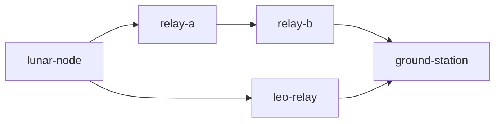

# AetherNet Architecture

AetherNet is a deterministic DTN simulator focused on space-like intermittent links.
The reference topology used throughout the project includes `lunar-node`, relay nodes, and `ground-station`.

## Module responsibilities

- `sim/`: scenario selection, simulator orchestration, reporting, experiment harness, and demo entrypoints.
- `router/`: contact-aware forwarding logic, routing policies, delivery accounting, and route selection abstractions.
- `bundle_queue/`: strict-priority queueing and bundle admission ordering.
- `store/`: filesystem-backed DTN object storage, expiry handling, and retained bundle state.

## Reference execution path

1. Bundles are injected at `lunar-node`.
2. `router/` resolves a next hop based on the configured routing mode.
3. `bundle_queue/` controls dequeue order.
4. `store/` persists in-flight bundles for store-carry-forward behavior.
5. `sim/` advances the clock and materializes deliveries to `ground-station`.
