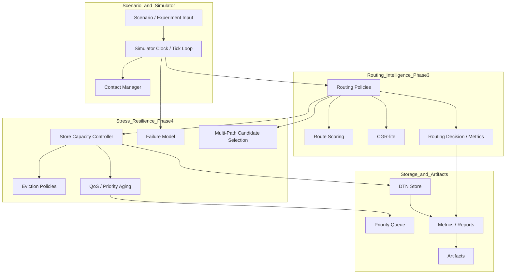
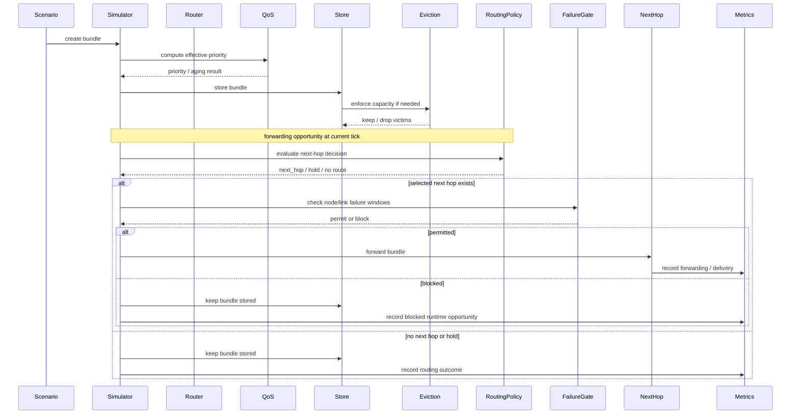

# AetherNet Phase-3 / Phase-4 Whitepaper

**Audience:** handoff AI agents, new engineers, future maintainers  
**Purpose:** explain what Phase-3 and Phase-4 added, how the pieces fit together, and what assumptions should be preserved when continuing development.

---

# 1. Executive Summary

AetherNet is no longer only a Phase-2 transport simulator.

After Phase-3 and Phase-4, the repository now contains a **routing-and-resilience experimentation core** with the following major capabilities:

- pluggable routing policies
- deterministic static routing baseline
- current-contact-aware routing
- scored multi-candidate routing
- CGR-lite bounded future-contact reasoning
- routing observability with decision reasons and metrics
- finite storage capacity and congestion-control baseline
- QoS service-class modeling with priority aging
- storage-pressure modeling via deterministic eviction policies
- opportunistic hold-vs-forward routing
- deterministic node/link failure and partition modeling
- bounded multi-path top-k candidate selection

Phase-3 delivered the **routing brain**.  
Phase-4 delivered the **stress / resilience shell** around that brain.

This means AetherNet can now be used for experiments such as:

- static vs contact-aware vs CGR-lite routing comparison
- immediate-forward vs hold-for-better-contact behavior
- low-storage vs high-storage relay behavior
- priority-aware vs age-aware eviction trade-offs
- outage / recovery experiments
- path-diversity experiments without uncontrolled replication

---

# 2. What Changed Across Phase-3 and Phase-4

## Before Phase-3

The system already had:

- deterministic simulation clock
- contact windows
- store-carry-forward behavior
- fragmentation / reassembly
- reliability helpers
- artifact export and experiment reporting

But routing logic was still relatively simple and under-specified as a research surface.

## After Phase-3

The system gained:

- routing policy abstraction
- multiple routing baselines with different decision semantics
- bounded future-contact reasoning
- routing decision observability and metrics

## After Phase-4

The system gained:

- finite storage constraints
- deterministic congestion / drop behavior
- QoS priority aging
- storage-pressure policy comparison
- opportunistic waiting behavior
- failure / partition runtime gating
- bounded multi-path candidate selection

---

# 3. Architectural View

## 3.1 Layered Summary



## 3.2 Core Principle

The architectural boundary that matters most is:

- **routing policy** decides what path looks desirable
- **runtime gates** decide whether forwarding is actually possible right now

Examples:

- CGR-lite may prefer a future route even if it is not open yet
- opportunistic routing may choose to hold instead of sending now
- failure model may block forwarding even when the route is logically valid
- storage pressure may force drops even when a route exists

That separation is intentional and should be preserved.

---

# 4. Phase-3 Details: Routing Layer

Phase-3 adds the decision logic necessary to treat AetherNet as a routing research platform.

## 4.1 Routing Policy Framework (Wave-37)

The repository moved from “one implicit routing behavior” to “policy-injected routing behavior”.

Key design intent:

- different routing algorithms should plug into the same runtime path
- tests should validate policy behavior independently
- default behavior must remain backward-compatible

Result:

```text
AetherRouter delegates next-hop decisions to a policy object.
```

## 4.2 Static Routing Baseline (Wave-38)

Static routing remains the anchor baseline.

Why it matters:

- it is debuggable
- it is deterministic
- it gives later policies a comparison target

Key semantics:

- destination reached -> no next hop
- unknown route -> no next hop
- explicit bundle override still honored

## 4.3 Contact-Aware Routing (Wave-39)

This introduces the distinction between:

- route exists
- route usable now

The policy only returns a hop if the relevant contact is open right now.

This gives AetherNet a true “contact-aware routing now” baseline.

## 4.4 Route Scoring (Wave-40)

This adds deterministic ranking among multiple candidates.

It does **not** do full graph search.

Instead, it provides:

- candidate set
- score-based selection
- lexical tie-break

This is the first point where AetherNet can compare multiple same-destination choices without hardcoding one winner.

## 4.5 CGR-lite (Wave-41)

CGR-lite is deliberately bounded.

It is **not** a full NASA-grade CGR implementation.

What it does:

- looks ahead into future contact opportunities
- estimates bounded future path quality
- prefers earlier arrival opportunities
- remains deterministic and testable

Most important semantic distinction:

```text
preferred future path != currently forwardable path
```

The router runtime still decides whether forwarding can happen at the current tick.

## 4.6 Routing Observability (Wave-42)

This phase makes routing behavior explainable.

Main artifacts:

- `RoutingDecision`
- reason strings such as `no_route`, `contact_blocked`, `selected_future_route`
- `RoutingMetricsCollector`

This enables experimental policy comparison without changing the runtime contract.

---

# 5. Phase-4 Details: Stress / Resilience Layer

Phase-4 asks a different question:

> What happens when the network is constrained, congested, interrupted, or only partially usable?

## 5.1 Congestion Control Baseline (Wave-43)

This is where finite storage first appears.

Key behavior:

- a node store can now exceed capacity
- overflow must be resolved deterministically
- drops become observable

This removes the unrealistic assumption of infinite relay capacity.

## 5.2 QoS and Priority Aging (Wave-44)

QoS is intentionally introduced as a helper layer first.

Why:

- low-risk introduction
- no queue rewrite required
- pure function semantics

Key capability:

- effective priority increases over time
- low-priority bundles need not starve forever

This becomes especially relevant under storage pressure.

## 5.3 Storage Pressure Modeling (Wave-45)

Eviction strategy becomes a first-class research variable.

Implemented baselines:

- `DropLowestPriorityPolicy`
- `DropOldestPolicy`

Result:

AetherNet can compare “protect mission-critical traffic” vs “protect freshness / turnover”.

## 5.4 Opportunistic Routing (Wave-46)

This introduces bounded hold-vs-forward behavior.

Meaning:

- a currently open path is not automatically taken
- if a better near-future opportunity appears within the hold window, the policy can hold

This is the first deliberately DTN-native “wait for better opportunity” baseline in the repo.

## 5.5 Failure / Partition Modeling (Wave-47)

Failure modeling is deliberately implemented as a **runtime gate**, not as a routing-policy concern.

That means:

- routing policy can still compute a reasonable path
- forwarding can still be denied because the node or link is down

Supported today:

- node outage windows
- link failure windows
- deterministic recovery after window end

This makes partition and recovery experiments possible without destabilizing routing policy logic.

## 5.6 Multi-Path Candidate Selection (Wave-48)

This is a bounded multipath baseline.

Important non-goal:

- it does **not** yet perform full runtime replication

What it does:

- rank open candidate next hops
- return deterministic top-k paths
- preserve the old single-next-hop API via top-1 fallback

This is the right place to stop before true replicated forwarding, because it gives path-diversity research value without triggering storage explosion.

---

# 6. Completed Wave Map

```mermaid
flowchart LR
    W37[Wave-37\nRouting Policy Framework] --> W38[Wave-38\nStatic Routing]
    W38 --> W39[Wave-39\nContact-Aware Routing]
    W39 --> W40[Wave-40\nRoute Scoring]
    W40 --> W41[Wave-41\nCGR-lite]
    W41 --> W42[Wave-42\nRouting Metrics]
    W42 --> W43[Wave-43\nFinite Storage / Congestion]
    W43 --> W44[Wave-44\nQoS / Priority Aging]
    W44 --> W45[Wave-45\nStorage Pressure Modeling]
    W45 --> W46[Wave-46\nOpportunistic Routing]
    W46 --> W47[Wave-47\nFailure / Partition Modeling]
    W47 --> W48[Wave-48\nMulti-Path Candidate Selection]
```



---

# 7. Current Runtime Sequence After Phase-3 / Phase-4

A bundle now passes through more decision layers than in Phase-2.



---

# 8. Current Repository Surfaces That Matter Most

For handoff purposes, these are the most important Phase-3 / Phase-4 surfaces.

## Routing / decision surfaces

```text
router/routing_policies.py
router/contact_graph.py
router/route_scoring.py
router/routing_decision.py
metrics/routing_metrics.py
```

## Storage / stress surfaces

```text
router/store_capacity.py
router/eviction_policy.py
router/qos.py
metrics/congestion_metrics.py
```

## Runtime resilience surfaces

```text
router/failure_model.py
router/app.py
```

## Test anchors

```text
tests/test_routing_policy.py
tests/test_congestion.py
tests/test_storage_pressure.py
tests/test_qos.py
tests/test_failure_model.py
tests/test_routing_metrics.py
```

---

# 9. Key Invariants Future Contributors Should Preserve

## 9.1 Deterministic ordering everywhere

When multiple valid choices exist, ordering must stay explicit and stable.

Common tie-break pattern:

- score or priority first
- then earlier time if relevant
- then lexical id / hop name

## 9.2 Keep additive APIs over breaking APIs

Examples worth preserving:

- `select_next_hop(...)` remains stable even when richer behaviors are added
- top-k multipath uses an additive method rather than replacing the single-hop API
- routing observability uses `evaluate_decision(...)` while preserving legacy entrypoints

## 9.3 Keep routing logic separate from runtime gating

Routing policy should decide:

- what looks desirable
- whether to hold or route
- which candidates are preferred

Runtime gates should decide:

- whether contact is open now
- whether node/link failure blocks forwarding
- whether storage pressure forces drops

## 9.4 Avoid unbounded replication

Wave-48 intentionally stops at **candidate selection**, not uncontrolled multi-copy forwarding.

Future work may add replicated execution, but only with clear storage and observability controls.

---

# 10. What Remains Unfinished

Phase-3 and Phase-4 are now complete enough for meaningful experiments, but the repository still lacks:

- scenario generation at scale
- parameter sweep automation
- policy-comparison framework at experiment level
- paper-ready experiment packaging
- full replicated multipath execution
- storage-aware routing policies
- probabilistic reliability modeling

Those belong to later phases and should not be backported casually into the current baseline.

---

# 11. Recommended Next Step

The most aligned next work after Phase-3 / Phase-4 is:

```text
Phase-5
Wave-49 scenario generator
Wave-50 parameter sweep engine
Wave-51 routing comparison framework
Wave-52 paper-ready experiment pipeline
```

That order is preferable because AetherNet already has enough behavior variety.  
The next bottleneck is not “more policy ideas” but “better experiment scalability and reproducibility”.

---

# 12. Handoff Summary

If a future AI agent or engineer is picking up this repository cold, the correct mental model is:

```text
Phase-1 / Phase-2 / Phase-2.2 built the deterministic transport simulator.
Phase-3 built the routing brain.
Phase-4 built the stress / resilience shell around that brain.
Phase-5 should now industrialize experiment generation and policy comparison.
```

If only one sentence is preserved, preserve this one:

> AetherNet is now a deterministic DTN routing-and-resilience experimentation core, and the next priority is scalable experiment generation rather than more ad hoc policy complexity.
