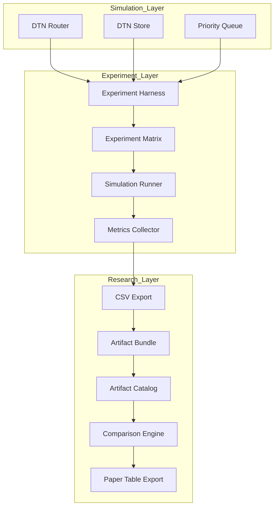

# AetherNet Phase-5 Whitepaper

- **Phase Name:** Experimentation & Research Pipeline
- **Wave Coverage:** Wave-52 → Wave-58
- **Goal:** Transform AetherNet from a DTN simulator into a reproducible research system

---

# 1. Phase Positioning

Phase-5 extends Phase-3/4 capabilities (routing, storage, delivery) into a **structured experimentation pipeline**.

```text
Phase-3 → Routing correctness
Phase-4 → Delivery behavior + reliability
Phase-5 → Experimentation + comparison + publication
```

This phase introduces a new layer:

```text
Simulation Layer → Experiment Layer → Research Layer
```

---

# 2. Phase-5 System Architecture



---

# 3. Core Responsibilities

## 3.1 Simulation Layer (Existing)

Responsibilities:

- contact-aware routing
- store-carry-forward
- priority-based scheduling

This layer remains unchanged from Phase-3/4.

---

## 3.2 Experiment Layer (Wave-52 ~ Wave-54)

### Experiment Harness

- deterministic execution entrypoint
- scenario isolation

### Experiment Matrix

- multi-case generation
- parameterized runs

### Metrics Collector

- delivery metrics
- queue metrics

### Export Layer

- CSV export
- deterministic schema

---

## 3.3 Research Layer (Wave-55 ~ Wave-58)

### Artifact Bundle

Each run produces:

```text
summary.csv
summary.json
manifest.json
```

Guarantees:

- reproducibility
- self-contained results

---

### Artifact Catalog

- multi-batch indexing
- strict validation
- deterministic ordering

---

### Comparison Engine

- FULL OUTER JOIN on case_name
- left/right symmetric comparison
- missing-case detection

---

### Paper Table Export

- flat CSV output
- explicit status column:

```text
both
only_left
only_right
```

---

# 4. End-to-End Pipeline

```text
Scenario
→ Experiment Harness
→ Simulation Execution
→ Metrics Collection
→ CSV Export
→ Artifact Bundle
→ Catalog
→ Batch Comparison
→ Paper Table
```

This pipeline is:

- deterministic
- reproducible
- automation-ready
- paper-ready

---

# 5. System Guarantees

Phase-5 introduces the following guarantees:

## Determinism

- identical input → identical output

## Reproducibility

- artifacts fully describe execution

## Composability

- batches can be combined and compared

## Auditability

- manifest.json enables traceability

---

# 6. What Phase-5 Does NOT Do

Out of scope (aligned with HLD):

- identity-based authentication
- mTLS / SPIFFE integration
- secure forwarding validation

These are deferred to **Security Waves (S-Waves)**.

---

# 7. Phase Outcome

After Phase-5, AetherNet becomes:

```text
DTN Research Experimentation Platform
```

Not just a simulator.

---
