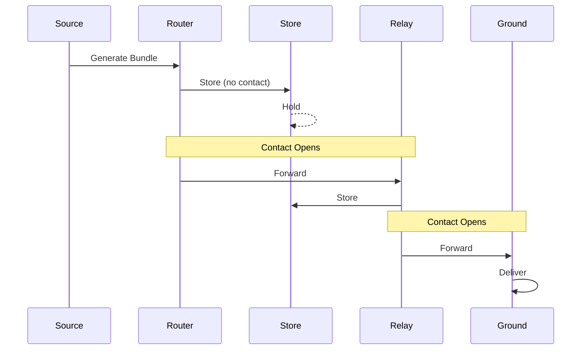
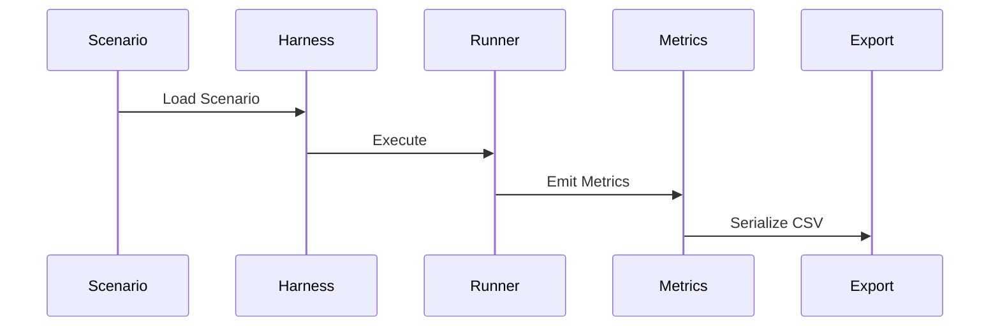
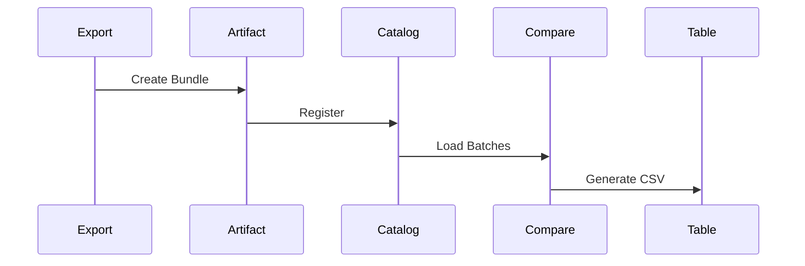

# AetherNet System Sequence (Wave-58)

## Purpose

Describe the **full system lifecycle** across:

- simulation
- experiment execution
- research output

---

# 1. Runtime Lifecycle (DTN Core)



---

# 2. Experiment Lifecycle



---

# 3. Research Lifecycle



---

# 4. Unified Lifecycle

```text
Bundle Flow
→ Simulation
→ Experiment Execution
→ Metrics
→ Artifact
→ Catalog
→ Comparison
→ Paper Output
```

---

# AetherNet

A Secure Delay-Tolerant Distributed Infrastructure Prototype for Space Networks

---

## System Overview

AetherNet is a DTN-inspired system designed for:

- intermittent connectivity
- high latency
- space-like environments

---

## Current Capability (Wave-58)

### Core

- contact-aware routing
- store-carry-forward
- priority scheduling

### Experiment

- deterministic harness
- matrix execution

### Research

- artifact bundles
- catalog system
- batch comparison
- paper-ready export

---

## System Pipeline

```text
Simulation → Experiment → Artifact → Catalog → Comparison → Paper Output
```

---
