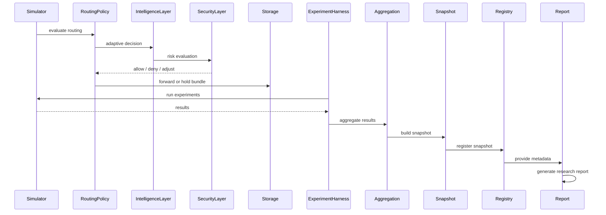

# 1. End-to-End Lifecycle (Phase-6)



---

# 2. Layered Architecture

## Core Layers

```
Simulation Layer
→ Routing Layer
→ Intelligence Layer (NEW)
→ Security Layer (NEW)
→ Research Pipeline Layer
→ Report Layer
```

---

# 3. Key Transitions from Phase-5

### Before

- static routing
- deterministic evaluation

### After

- adaptive routing
- policy-driven decisions
- security-aware behavior

---

# 4. Determinism Flow

Even with adaptive features:

```
seeded randomness
→ controlled execution
→ reproducible results
→ comparable outputs
```

---

# 5. Research Workflow

```
define scenario
→ run experiment
→ generate snapshot
→ compare snapshots
→ export comparison
→ generate report
→ analyze results
```

---
