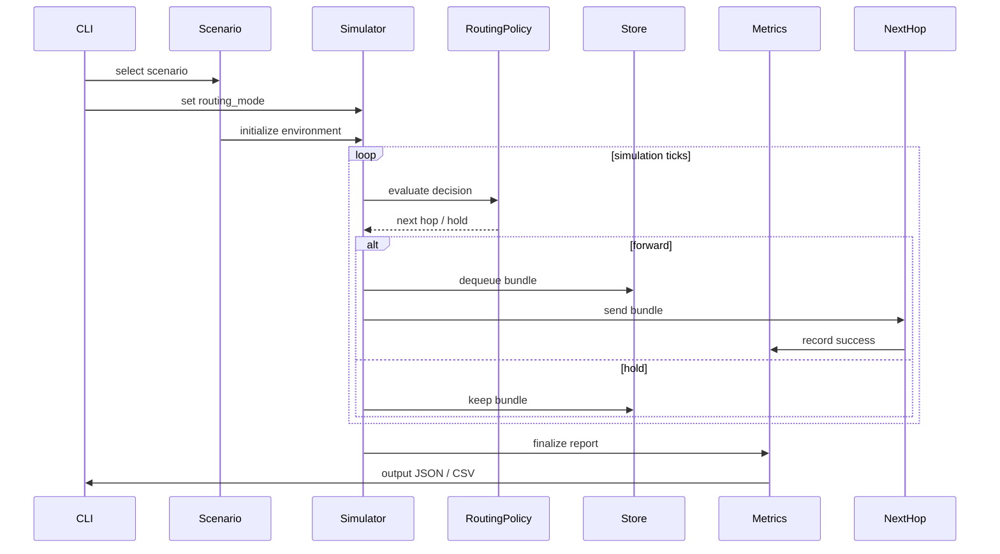

# AetherNet System Sequence — Phase Demo

## Purpose

This document describes how demo execution differs from base simulation.

Focus:

- routing-mode injection
- scenario-driven divergence
- deterministic comparison

---

## High-Level Flow

```text
Demo CLI
↓
Scenario Selection
↓
Routing Mode Injection
↓
Simulator Execution
↓
Routing Decision
↓
Forwarding Outcome
↓
Metrics Collection
↓
Artifact Export
```

````

---

## Detailed Sequence



---

## Key Differences from Base Sequence

| Aspect          | Base       | Demo                  |
| --------------- | ---------- | --------------------- |
| routing control | internal   | CLI-controlled        |
| comparison      | implicit   | explicit              |
| output          | metrics    | artifact + comparison |
| purpose         | simulation | evaluation            |

---

## Design Principle

Demo layer enforces:

- identical scenario
- identical inputs
- only routing policy differs

---

## Result

This guarantees:

- fair comparison
- deterministic outcomes
- reproducible experiments

````
