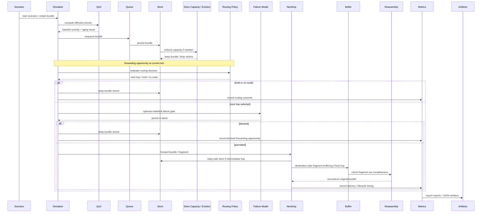
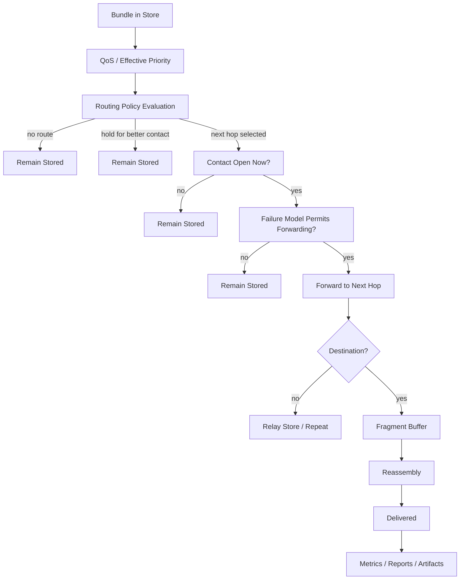

# AetherNet System Sequence

This document describes the **end-to-end lifecycle of a bundle** inside the current AetherNet system.

It is written for handoff and architecture continuity.

The goal is to show how a bundle now moves through the platform after completion of:

- Phase-2 transport reliability
- Phase-2.2 observability and artifact export
- Phase-3 routing intelligence
- Phase-4 stress / resilience modeling

This is no longer only a Phase-2 transport pipeline.  
The runtime path now includes:

- routing-policy evaluation
- QoS / effective priority calculation
- storage-capacity enforcement
- optional opportunistic holding
- optional failure / partition runtime blocking
- bounded multi-path candidate selection

---

# 1. High-Level Lifecycle

The simplified current lifecycle is:

```text
Bundle Created
↓
QoS Baseline Priority / Aging Evaluation
↓
Priority Queue / Store Admission
↓
Store Capacity Enforcement
↓
Routing Policy Decision
↓
(optional) Hold for Better Opportunity
↓
Contact Window Check
↓
(optional) Failure / Partition Runtime Gate
↓
Forwarding Hop
↓
Relay Storage / Repeat
↓
Destination Buffering
↓
Reassembly
↓
Bundle Delivered
↓
Metrics / Reports / Artifacts Exported
```

---

# 2. Current Runtime Sequence



---

# 3. Step-by-Step Explanation

## 3.1 Bundle Generation

Bundles are created by scenario logic.

Typical bundle types include:

```text
telemetry
science
bulk
navigation
```

Each bundle carries metadata such as:

```text
bundle_id
priority
created_at
ttl_sec
size_bytes
destination
```

---

## 3.2 QoS Priority Evaluation

Before forwarding pressure is considered, AetherNet can compute an **effective priority** based on:

- intrinsic bundle priority
- service-class baseline
- deterministic priority aging

Module:

```text
router/qos.py
```

Purpose:

- preserve service differentiation
- reduce starvation under long waits
- keep QoS logic pure and deterministic

---

## 3.3 Queue and Store Admission

Bundles enter the strict priority queue and then are persisted into the DTN store.

Modules:

```text
bundle_queue/priority_queue.py
store/store.py
```

Purpose:

- preserve ordering discipline
- support store-carry-forward behavior during disconnected windows

---

## 3.4 Store Capacity Enforcement

The store no longer behaves as infinite.

Modules:

```text
router/store_capacity.py
router/eviction_policy.py
metrics/congestion_metrics.py
```

Possible outcomes:

- bundle is stored successfully
- one or more victims are evicted due to storage pressure

Current eviction baselines include:

```text
DropLowestPriorityPolicy
DropOldestPolicy
```

---

## 3.5 Routing Policy Evaluation

At each forwarding opportunity, AetherNet asks the active routing policy to evaluate what should happen next.

Primary module:

```text
router/routing_policies.py
```

Possible policy outputs now include:

- static route selection
- contact-aware route gating
- scored candidate selection
- CGR-lite future path preference
- opportunistic hold-for-better-contact
- bounded multi-path candidate selection

This is the main Phase-3 intelligence layer.

---

## 3.6 Hold-vs-Forward Decision

In opportunistic scenarios, the routing policy may decide **not** to forward immediately even when some path exists.

Why:

- a better contact may open soon
- waiting may increase route quality
- forwarding now may be strategically worse

This is still deterministic and bounded by the configured hold window.

---

## 3.7 Contact Window Check

Even when the routing policy selects a next hop, forwarding still requires a currently open contact.

Module:

```text
router/contact_manager.py
```

This preserves the distinction between:

- preferred route
- usable route at the current tick

---

## 3.8 Failure / Partition Runtime Gate

Even if the contact plan says a link is open, forwarding may still be blocked by runtime failure conditions.

Module:

```text
router/failure_model.py
```

Supported runtime disruptions:

- node outage windows
- link failure windows
- later recovery after the failure window ends

Important architectural rule:

```text
routing policy chooses the route
failure model decides whether reality allows the transfer now
```

---

## 3.9 Forwarding Hop

If all gates pass:

- bundle or fragment is forwarded to the next hop
- relay nodes store it for the next contact window
- destination nodes buffer fragments for possible reassembly

---

## 3.10 Relay Storage and Repeated Hops

Intermediate relay nodes repeat the same lifecycle:

```text
store
wait
route
check contact
check failure model
forward
```

This is where:

- storage pressure
- congestion
- QoS
- failure windows
- path diversity

become experimentally meaningful.

---

## 3.11 Fragment Buffering and Reassembly

At destination-side reception:

- fragments are buffered
- completeness is checked
- the original bundle is reassembled only when the full set is valid

Modules:

```text
protocol/reassembly_buffer.py
protocol/reassembly.py
```

---

## 3.12 Delivery, Metrics, and Artifacts

After successful delivery, AetherNet records:

- lifecycle timing
- delivery outcomes
- routing decision metrics
- storage-pressure metrics
- experiment comparison artifacts

Modules:

```text
metrics/network_metrics.py
metrics/routing_metrics.py
metrics/congestion_metrics.py
sim/reporting.py
sim/artifact_export.py
```

Outputs include deterministic JSON artifacts suitable for offline analysis.

---

# 4. Sequence Variants Introduced After Phase-2

## 4.1 Routing-Driven Hold

A bundle may remain in storage **not because no path exists**, but because the policy chose to hold for a better near-future contact.

## 4.2 Runtime Block Despite Valid Route

A routing policy may select a valid next hop, yet forwarding can still fail because:

- the target node is in outage
- the link is inside a failure window

## 4.3 Store Overflow and Eviction

A bundle may be dropped before forwarding due to:

- finite storage limit
- eviction policy outcome

## 4.4 Multi-Path Candidate Selection

A policy may now identify multiple valid current next hops, while legacy runtime compatibility still uses top-1 forwarding unless future waves explicitly introduce replicated execution.

---

# 5. Mermaid: Decision and Runtime Gates



---

# 6. Key Properties Future Maintainers Must Preserve

## Deterministic ordering

All decisions with multiple valid outcomes must have stable tie-breaks.

## Separation of policy vs runtime gate

Do not collapse these layers casually.

## Bounded complexity

- opportunistic routing is bounded by hold window
- multi-path is bounded by top-k candidate selection
- failure modeling is bounded by deterministic outage windows

## Backward-compatible entrypoints

Legacy runtime still relies on:

```text
select_next_hop(...)
can_forward(...)
can_forward_destination(...)
```

These compatibility paths should remain stable unless there is a very strong reason to change them.

---

# 7. Summary

The current AetherNet system sequence is no longer only:

```text
bundle creation
fragmentation
queueing
store-carry-forward
forwarding
reassembly
reporting
```

It is now:

```text
bundle creation
QoS evaluation
queue/store admission
storage-capacity enforcement
routing-policy evaluation
optional opportunistic hold
contact check
failure / partition gate
forwarding
relay repetition
reassembly
metrics and artifact export
```

This is the correct mental model for all future handoff work.
