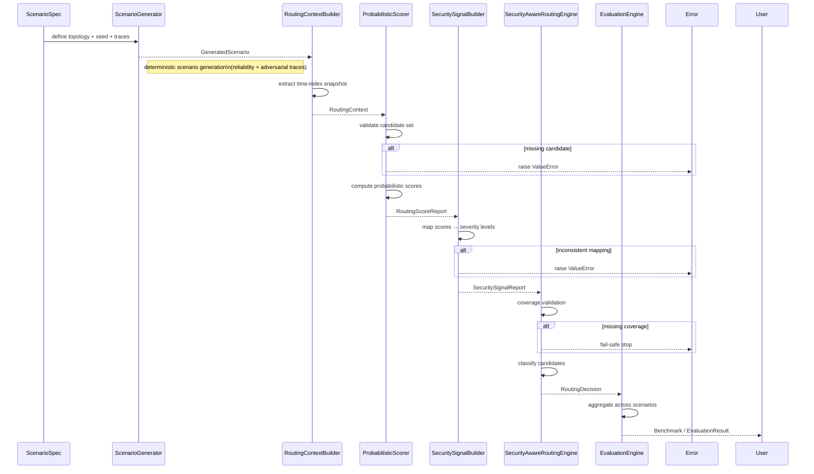

# AetherNet Phase-6 System Sequence

## Deterministic Decision Pipeline

This document defines the **end-to-end execution flow** of Phase-6.

Phase-6 introduces a **deterministic decision pipeline** that operates independently from the runtime forwarding loop.

---

## System Position

AetherNet consists of two planes:

```text
Runtime Plane (Phase 1–5)
    → executes DTN forwarding

Decision Plane (Phase-6)
    → evaluates and produces routing decisions
````

This document describes the **Decision Plane execution flow**.

---

## High-Level Pipeline

```text
ScenarioSpec
↓
ScenarioGenerator
↓
RoutingContextBuilder
↓
ProbabilisticScorer
↓
SecuritySignalBuilder
↓
SecurityAwareRoutingEngine
↓
Evaluation / Benchmark
```

---

## End-to-End Sequence (Detailed)



---

## Component Responsibilities

### 1. ScenarioSpec

Defines:

* topology
* nodes and links
* contact plan
* deterministic seed

---

### 2. ScenarioGenerator

Generates:

* full network state
* reliability traces
* adversarial traces

Guarantee:

* same input seed → identical scenario

---

### 3. RoutingContextBuilder

Extracts:

* time-indexed snapshot
* candidate links
* observed conditions

Output:

```text
RoutingContext
```

---

### 4. ProbabilisticScorer

Computes:

* estimated_success_probability
* penalty breakdown
* explainable scoring reasons

Output:

```text
RoutingScoreReport
```

---

### 5. SecuritySignalBuilder

Transforms:

* probabilities → severity levels
* observations → threat indicators

Output:

```text
SecuritySignalReport
```

---

### 6. SecurityAwareRoutingEngine

Produces:

```text
preferred / allowed / avoid
```

Output:

```text
SecurityAwareRoutingDecision
```

---

### 7. Evaluation Engine

Handles:

* multi-scenario execution
* aggregation
* benchmark generation

---

## Decision Contract

### Input

* RoutingContext
* RoutingScoreReport
* SecuritySignalReport

### Output

```text
SecurityAwareRoutingDecision
```

### Invariants

1. **Full Coverage**
   every candidate must appear exactly once

2. **Determinism**
   identical input → identical output

3. **Fail-Safe**
   missing or inconsistent data → explicit error

---

## Deterministic Guarantees

For input:

```text
(ScenarioSpec, Seed, TimeIndex, CandidateSet)
```

Outputs are guaranteed identical:

* RoutingContext
* RoutingScoreReport
* SecuritySignalReport
* RoutingDecision

---

## Error Handling Strategy

Phase-6 enforces **fail-fast behavior**:

| Error Type                 | Behavior       |
| -------------------------- | -------------- |
| missing candidate          | raise error    |
| inconsistent score mapping | raise error    |
| incomplete signal coverage | abort decision |

No silent fallback is allowed.

---

## Integration Boundary (Important)

Phase-6 does NOT:

* modify simulator runtime state
* inject routing decisions into forwarding loop

Instead, it produces:

```text
decision artifacts
```

Future waves will introduce:

```text
Decision → Runtime bridge
```

---

## Summary

Phase-6 defines a:

> deterministic, explainable, fail-safe routing decision pipeline

that can be used for:

* security-aware routing evaluation
* adversarial scenario analysis
* reproducible benchmarking
