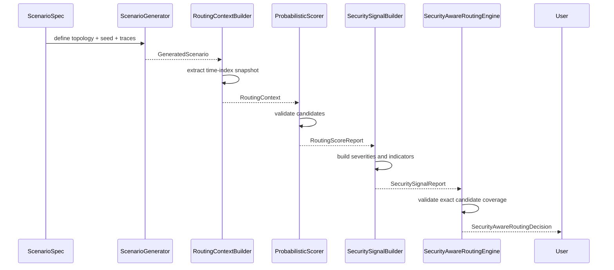
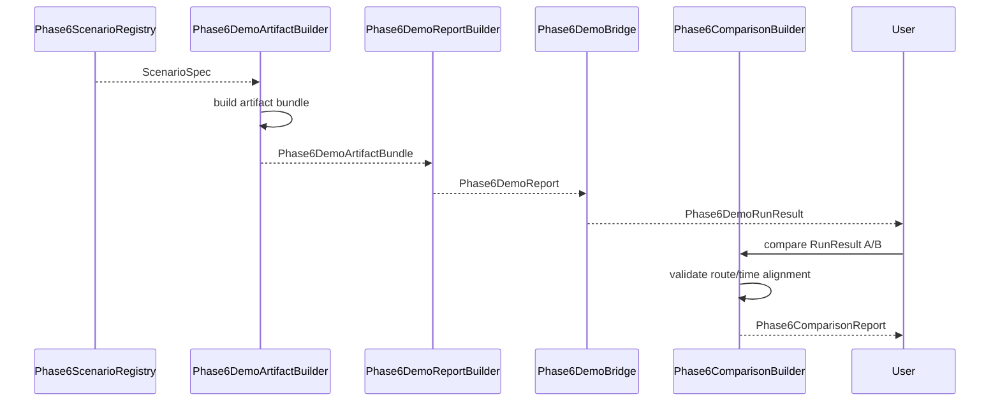

# AetherNet Phase-6 System Sequence

## Decision Plane and Demo Plane

This document describes the deterministic execution flow of Phase-6.

---

## 1. System Position

AetherNet is split into three planes:

```text
Runtime Plane (Phase 1–5)
    → executes forwarding

Decision Plane (Phase-6 Core)
    → evaluates candidate links and produces decision artifacts

Presentation Plane (Phase-6 Demo)
    → renders artifacts into reports and comparisons
````

---

## 2. Core Decision Pipeline



---

## 3. Demo Presentation Pipeline



---

## 4. Invariants

* deterministic seeds
* stable serialization ordering
* explicit candidate coverage validation
* no mutation leakage from exported artifacts
* no runtime forwarding mutation

---

## 5. Failure Strategy

Phase-6 is fail-fast:

* invalid scenario name → error
* invalid routing context input → error
* missing score/signal candidate coverage → error
* mismatched comparison route/time → error

No silent fallback is allowed.

---

## 6. Boundary

Phase-6 does not yet bridge decisions into the runtime forwarding loop.
That is a future integration task, not part of the current implemented system.