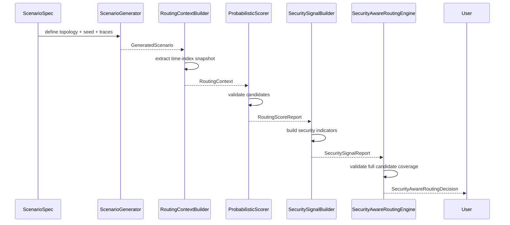
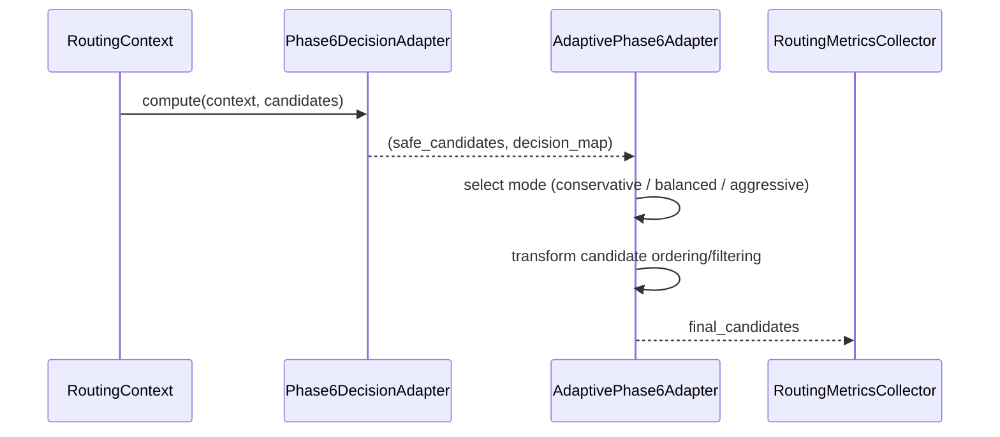
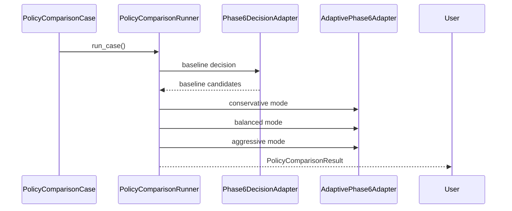
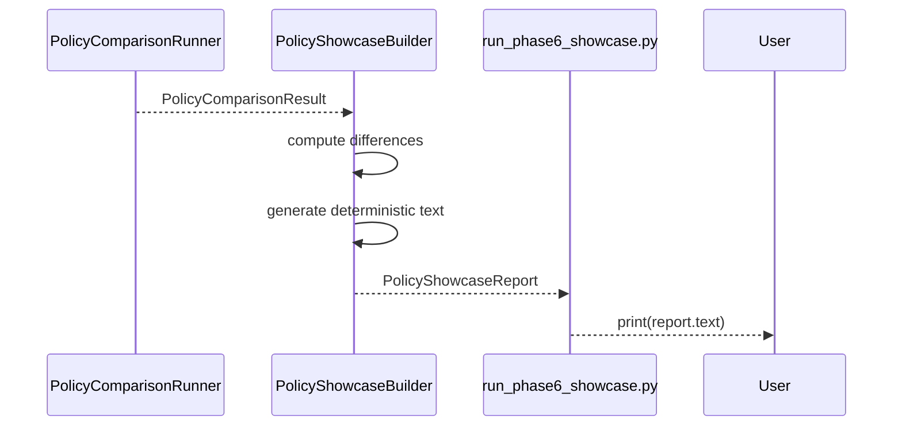

# AetherNet System Sequence

## Phase-6 / Phase-7 Deterministic Decision and Runtime Showcase Flow

---

## 1. System Position

AetherNet is structured into three planes:

```text
Runtime Plane (Phase-1~5)
    → executes DTN forwarding simulation

Decision Plane (Phase-6)
    → evaluates candidate links and produces deterministic decisions

Runtime / Presentation Plane (Phase-7)
    → applies decisions, adapts behavior, and produces showcase outputs
````

Key design principle:

> **Strict decoupling between simulation, decision, and presentation layers**

---

## 2. End-to-End Conceptual Flow

```text
Scenario
→ Simulation State
→ Routing Context
→ Decision Pipeline
→ Runtime Adapter
→ Adaptive Policy
→ Comparison
→ Showcase Report
```

Each stage is:

* deterministic
* composable
* testable in isolation

---

## 3. Phase-6 Decision Pipeline (Core)



---

## 4. Decision Output Model

Each candidate link is classified as:

```text
preferred → safe / optimal
allowed   → usable but degraded
avoid     → unsafe / adversarial
```

Constraints:

* every candidate must be classified
* no missing or implicit decisions
* ordering must be deterministic

---

## 5. Phase-7 Runtime Adaptation Flow



---

## 6. Adaptive Modes Behavior

### Conservative

```text
preferred only (if exists)
else allowed
avoid always removed
```

---

### Balanced

```text
preferred → allowed
avoid removed
```

---

### Aggressive

```text
preserve original order
remove only avoid
```

---

## 7. Policy Comparison Flow (Wave-93)



---

## 8. Showcase Generation Flow (Wave-94 / 95)



---

## 9. CLI Entry Point

```bash
python scripts/run_phase6_showcase.py
```

Execution flow:

```text
build RoutingContext
→ create PolicyComparisonCase
→ run comparison
→ build showcase report
→ print deterministic output
```

---

## 10. Deterministic Guarantees

The entire pipeline guarantees:

* identical inputs → identical outputs
* no randomness in adaptive behavior
* stable ordering of candidates
* stable text output formatting

This includes:

```text
RoutingContext
Decision output
Adaptive results
Comparison output
Showcase report
```

---

## 11. Failure Strategy

The system is fail-fast:

* invalid scenario → error
* invalid routing context → error
* missing candidate coverage → error
* inconsistent comparison input → error

No silent fallback is allowed.

---

## 12. Boundary Definition

The current system does NOT:

* inject decisions into live simulator loop
* compute multi-hop secure paths
* perform online learning or adaptation
* provide UI/dashboard visualization

These are future extensions.

---

## 13. Mental Model Summary

```text
Phase-1~5 → simulate reality
Phase-6   → understand the network
Phase-7   → control behavior (deterministically)
Showcase  → explain the system
```

---

## 14. Key Insight

AetherNet is not just a simulator.

It is:

> a deterministic decision system that can evaluate, control, and explain routing behavior in adversarial DTN environments.


