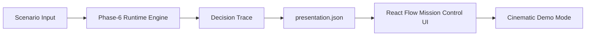

# AetherNet

**Deterministic Explainable Routing for Adversarial Space-Like Networks**

AetherNet is a deterministic, DTN-inspired routing simulation and visualization platform for intermittent, degraded, and adversarial space-like network environments.

The project explores a core problem in resilient networking: routing decisions are often invisible. When a link is degraded, jammed, or otherwise risky, operators may see the final delivery result but not the decision process that led to a path being selected or avoided.

AetherNet makes invisible network routing decisions visible, traceable, and explainable.

It does this by combining a deterministic Python backend, a Phase-6 security-aware routing decision layer, a structured presentation artifact, and a React Flow-based Mission Control UI that visualizes each routing decision step-by-step.

---

## Why AetherNet Exists

Space-like networks and Delay/Disruption-Tolerant Networks (DTNs) face conditions that are very different from ordinary terrestrial networks:

- intermittent contacts
- delayed communication windows
- link degradation
- adversarial interference
- limited observability
- high cost of operational mistakes

In these environments, it is not enough to know that a routing decision was made. Operators and researchers need to understand:

- what candidates were considered
- which route was selected
- whether the decision diverged from a legacy baseline
- why a safer route was preferred
- how the decision can be replayed and audited

AetherNet is designed around that explainability goal.

---

## Key Features

- **Deterministic scenario execution**  
  Same input scenario, same routing output, same presentation artifact.

- **Phase-6 security-aware routing decision layer**  
  Compares baseline routing behavior against security-aware Phase-6 decisions.

- **Legacy vs Phase-6 comparison**  
  Highlights cases where a legacy routing mode and Phase-6 mode select different paths.

- **Decision trace generation**  
  Converts routing decisions into step-by-step trace records.

- **Presentation artifact export**  
  Exports a frontend-ready `presentation.json` artifact that decouples backend logic from UI rendering.

- **React Flow cinematic visualization**  
  Renders routing decision steps as an animated graph in a Mission Control-style UI.

- **Story playback and recording mode**  
  Supports auto-playing demo mode for screen recording and portfolio presentation.

- **Reproducible test suite**  
  Current release validation: `make test` passes with 654 tests.

---

## Demo Showcase

The current demo focuses on a `jammed` scenario.

In this scenario:

- the legacy routing baseline selects a risky route
- the Phase-6 decision layer selects a safer alternative
- the UI visualizes the decision trace as an animated graph
- the narrative overlay explains each step of the routing decision

Screenshot placeholder:

```markdown

````

Recording-ready demo URL:

```text
http://localhost:3000/?mode=presentation&clean=true&recording=true&scenario=jammed
```

Standard dashboard URL:

```text
http://localhost:3000
```

---

## Quickstart

### 1. Run backend tests

```bash
make test
```

Expected validation for the current release:

```text
654 passed
```

### 2. Export the presentation payload

```bash
python scripts/export_presentation_json.py > aethernet-ui/public/presentation.json
```

This generates the deterministic artifact consumed by the frontend.

### 3. Start the frontend

```bash
cd aethernet-ui
npm install
npm run dev
```

Open the dashboard:

```text
http://localhost:3000
```

Open the recording-ready presentation mode:

```text
http://localhost:3000/?mode=presentation&clean=true&recording=true&scenario=jammed
```

---

## Architecture Overview



### Scenario Input

Defines the simulation case, including candidate routes and network conditions such as clean, degraded, jammed, or mixed-risk scenarios.

### Phase-6 Runtime Engine

Executes deterministic routing comparison between legacy behavior and Phase-6 security-aware decision behavior.

### Decision Trace

Captures the step-by-step routing decision process.

### `presentation.json`

A frontend-ready artifact containing:

* scenario metadata
* decisions
* metrics
* graph nodes
* graph edges
* story playback script

### React Flow Mission Control UI

Renders the artifact as a cinematic decision visualization. The frontend does not perform routing inference; it only renders backend-provided data.

### Cinematic Demo Mode

Provides a clean, recording-ready interface for demonstrating the routing decision trace.

---

## Current Scope

### Completed

* deterministic decision and demo pipeline
* Phase-6 security-aware routing comparison
* presentation artifact export
* React Flow-based visualization
* story playback
* recording-ready presentation mode
* release checklist and demo documentation

### Not Yet Completed

* live satellite telemetry ingestion
* production network controller integration
* real-time operational deployment
* full-scale multi-hop route optimization
* quantitative delivery, latency, and risk-score evaluation across large scenario suites

---

## Research Direction

AetherNet can support future research around:

**Explainable Security-Aware Routing for Delay-Tolerant Space Networks**

Possible research extensions include:

* explainable routing decisions in DTN-like environments
* adversarial link condition modeling
* deterministic replay for network forensics
* multi-hop path synthesis
* delivery success rate evaluation
* latency and disruption modeling
* quantitative path-risk scoring

The current system is best understood as a deterministic simulation and explainability platform, not a production routing controller.

---

## Product Direction

AetherNet can also evolve toward product-oriented use cases such as:

* mission-control style routing simulation
* security-aware network decision visualization
* infrastructure debugging for automated routing systems
* operator-facing explainability for complex network automation
* training and validation tools for resilient communication environments

These are future directions. The current release is a local, deterministic simulation and visualization prototype.

---

## Release

Current tagged release:

```text
v0.8-cinematic-demo
```

Release focus:

* cinematic demo mode
* React Flow visualization
* presentation artifact pipeline
* deterministic backend validation
* portfolio-ready showcase foundation

---

## Repository Positioning

AetherNet is not intended to claim operational deployment in real satellite networks.

It is currently a research and engineering prototype for studying how routing decisions in disrupted and adversarial network environments can be made:

* reproducible
* explainable
* visual
* auditable

