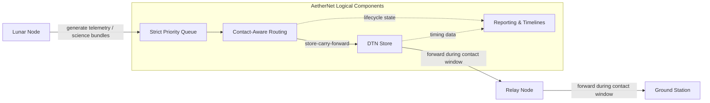
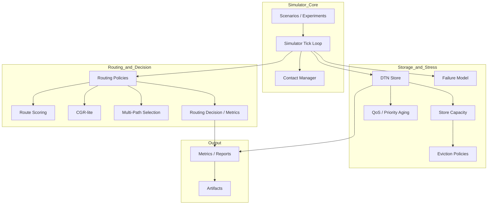
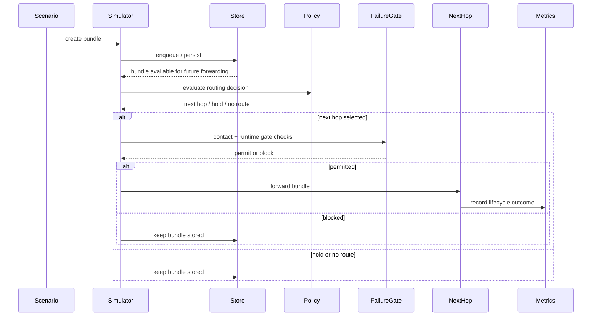
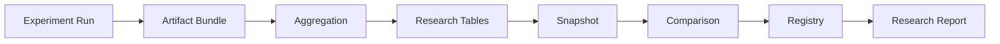

# AetherNet

**A Secure Delay-Tolerant Distributed Infrastructure Prototype for Space Networks**

> Current Status: Phase-5 COMPLETE  
> Next Steps:
>
> - Phase-6 (Adaptive Routing / Intelligence Layer)
> - Security S-Waves
> - large-scale scenario simulation


---

## What AetherNet Is

AetherNet is a **deterministic DTN simulation and experimentation platform** for space-like networks with:

- intermittent connectivity
- long delay
- store-carry-forward forwarding
- relay storage pressure
- routing-policy experimentation
- resilience / outage modeling

It is designed for:

- DTN routing research
- contact-aware forwarding experiments
- stress / resilience simulations
- artifact-driven comparison workflows
- future AI-agent and engineer handoff continuity

---

## What Has Been Implemented

### Phase-1 / Phase-2 / Phase-2.2 foundation

- simulator clock and scenario execution
- contact-window-driven forwarding
- strict priority queue
- store-carry-forward persistence
- fragmentation and reassembly
- retransmission / custody helpers
- experiment runner
- reports, visualization specs, and artifact export

### Phase-3 routing layer

- routing policy abstraction
- static routing baseline
- contact-aware routing
- route scoring for multi-candidate ranking
- CGR-lite bounded future-contact reasoning
- routing decision observability and routing metrics

### Phase-4 stress / resilience layer

- finite storage and congestion-control baseline
- QoS service differentiation and priority aging
- storage-pressure modeling with deterministic eviction policies
- opportunistic hold-vs-forward routing baseline
- deterministic failure / partition modeling
- bounded multi-path candidate selection

---

### ✅ Phase-5 Research Pipeline (NEW)

Phase-5 completes the transformation from **simulation system → research infrastructure**

#### Experiment → Research Pipeline

- parameter sweep execution
- experiment harness standardization
- artifact bundle generation

#### Aggregation & Tables

- sweep aggregation (cross-run)
- research_case_batch_table
- research_case_summary_table

#### Snapshot System

- research snapshot generation
- snapshot manifest (strict schema)
- snapshot query

#### Comparison System

- snapshot-to-snapshot comparison
- aggregation lineage validation
- row-count diff detection
- copied file diff tracking

#### Export Layer

- JSON export
- CSV export
- Markdown export

#### Registry & Report

- snapshot registry (multi-snapshot indexing)
- deterministic research report generation

👉 This enables:

- reproducible research workflows
- versioned experiment comparison
- paper-ready data pipeline
- AI-agent handoff continuity

---

## Built-in Reference Scenarios

AetherNet ships with deterministic reference scenarios that are used for baseline validation, README examples, and regression testing.

### `default_multihop`

Baseline multi-hop forwarding scenario.

Purpose:

- validate store-carry-forward delivery across multiple hops
- demonstrate the default deterministic forwarding path
- serve as the simplest end-to-end reference scenario

---

### `delayed_delivery`

Contact-delayed forwarding scenario.

Purpose:

- validate that bundles are held when no current contact is open
- demonstrate delayed forwarding once a future contact becomes available
- confirm deterministic hold-then-forward behavior

---

### `expiry_before_contact`

TTL-expiry-before-contact scenario.

Purpose:

- validate expiration behavior
- confirm deterministic TTL enforcement

---

## Repository Mental Model

```text
Phase-1 / 2 / 2.2 = transport core
Phase-3            = routing brain
Phase-4            = stress / resilience shell
Phase-5            = research pipeline & comparison system
Phase-6            = (next) intelligence / adaptive routing
```

---

## Architecture Overview

AetherNet models a delay-tolerant multi-hop path across a simplified reference topology:

- `lunar-node`
- `leo-relay`
- `ground-station`

Bundles are generated at the lunar node, prioritized by bundle type, stored during disconnected periods, and forwarded only when contact windows are open.



For additional architecture documentation, see:

- `docs/architecture.md`
- `docs/system-sequence.md`

## High-Level Architecture



---

## Runtime Lifecycle



For the detailed step-by-step sequence, see:

- `docs/system-sequence.md`

---

## Phase-5 Research Lifecycle (NEW)



---

## Core Source Areas

### Routing / decision logic

```text
router/routing_policies.py
router/contact_graph.py
router/route_scoring.py
router/routing_decision.py
metrics/routing_metrics.py
```

### Storage / stress / resilience

```text
router/store_capacity.py
router/eviction_policy.py
router/qos.py
router/failure_model.py
metrics/congestion_metrics.py
```

### Transport / simulation

```text
protocol/
sim/
store/
bundle_queue/
```

### Documentation / handoff

```text
README.md
docs/roadmap.md
docs/roadmap-phase-5.md
docs/roadmap-phase-6.md
docs/system-sequence.md
docs/system-sequence-phase-5.md
docs/system-sequence-phase-6.md
docs/phase-2-whitepaper.md
docs/phase-2-2-whitepaper.md
docs/phase-3-4-whitepaper.md
docs/phase-5-whitepaper.md
docs/phase-6-whitepaper.md
```

---

### Phase-5 Source Areas (NEW)

```text
sim/experiment_harness.py
sim/parameter_sweep.py
sim/sweep_aggregation.py
sim/research_table_export.py
sim/research_export_manifest.py
sim/research_snapshot.py
sim/research_snapshot_query.py
sim/research_snapshot_compare.py
sim/research_comparison_export.py
sim/research_snapshot_registry.py
sim/research_report.py
```

---

### 1. Environment setup

AetherNet requires Python 3.10+.

```bash
python3 -m venv .venv
source .venv/bin/activate
make setup-dev
```

### 2. Smoke validation

```bash
make smoke
```

### 3. Run a demo scenario

```bash
make demo
```

or:

```bash
./scripts/run_demo.sh
```

### 4. Run all built-in comparisons

```bash
make compare
```

or:

```bash
./scripts/run_compare.sh
```

Generated outputs are written under `artifacts/`.

### 5. Run tests

```bash
make test
```

or:

```bash
pytest tests/
```

---

## Current Recommended Reading Order for Handoff

Updated as following:

1. `README.md`
2. `docs/roadmap.md`
3. `docs/system-sequence.md`
4. `docs/system-sequence-phase-6.md`
5. `docs/phase-3-4-whitepaper.md`
6. `docs/phase-2-2-whitepaper.md`
7. `docs/phase-6-whitepaper.md`

---

## What Is Intentionally Not Here Yet

- real network transport planes
- orbital mechanics / RF-layer simulation
- uncontrolled replicated multipath execution
- probabilistic reliability models
- **adaptive routing policies (Phase-6)**
- **security-aware routing (Phase-6)**

---

## Next Recommended Roadmap Direction

```text
Phase-6 Intelligence Layer:

Wave-73 adaptive routing
Wave-74 probabilistic routing
Wave-75 policy evaluation engine
Wave-76 scenario generator
Wave-77 attack modeling
Wave-78 security-aware routing
```

---

## Summary

AetherNet is now:

> a deterministic DTN research infrastructure with full experiment → comparison → reporting pipeline

It supports:

- routing policy research
- resilience modeling
- reproducible experiment workflows
- snapshot-based version comparison

And is evolving toward:

> intelligent, adaptive, and secure space networking systems

```

```
